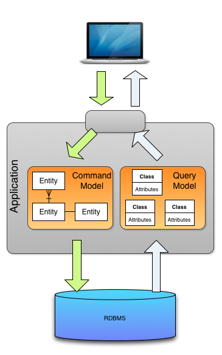

# Event Sourcing & CQRS

CQRS는 **Command Query Responsibility Segregation의** 약자입니다 . **Greg Young**이 처음 소개했다.  명령과 쿼리의 역할을 구분 한다는 뜻으로 커맨드 ( **C**reate - Insert, **U**pdate, **D**elete : 데이터를 변경) 와 쿼리 ( Select - **R**ead : 데이터를 조회)의 책임을 분리한다는 것이다. 

## 생겨난 이유
기존 CURD 기반에서 Aplication을 개발 하다보면 Domain Model의 복잡도가 증가되고 유지보수 비용이 증가하여 Domain Model이 의도한 방향과 다르게 된다. 

기존 Application의 Business Logic은 대 부분 데이터 변경(C, U, D) 작업으로 처리되고 데이터 조회(R) 작업은 단순 데이터 조회가 대 부분인데 이 두 업무를 동일한 Domain Model로 처리하면 각 업무 영역에 필요하지 않은 Doamin 속성들로 복잡도는 증가하고 Domain Model은 설계 목적과는 다른방향으로 가게된다.

이 문제를 해결하기 위해서는 **명령을 처리하는 책임**과 **조회를 처리하는 책임**을 분리 구현하면 된다. 이것이 CQRS이다.

## 사용 방법

일반적인 CURD 구조에서의 몇가지 제한 사항이 있다.

- CRUD 시스템이 데이터 저장소에 대해 직접 업데이트 작업을 수행한다는 사실은 필요한 처리 오버 헤드로 인해 성능과 응답 성을 방해하고 확장성 제한
- 동시 사용자가 많은 공동 작업 도메인에서는 업데이트 작업이 단일 데이터 항목에서 발생하기 때문에 데이터 업데이트 충돌이 발생할 가능성이 높다.
- 별도의 로그에 각 작업의 세부 정보를 기록하는 추가 감사 메커니즘이 없으면 기록이 손실

이런 일반적인 구조에 CQRS 패턴을 적용해보자.

### 단일 Data Store에 Command와 Query Model을 분리

RDBMS 는 분리하지 않고 Model Layer 부분만 Command와 Query Model로 분리한다. 분리된 Model은 각자의 Domain Layer에 대해서 만 모델링하고 코딩하기 때문에 훨씬 단순하게 구현/적용 할 수 있다. 하지만 동일 Database사용에 따른 성능상 문제점은 개선하지 못한다.

### Model분리와 RDBMS분리

Command용 Database와 Query용 Database를 분리하고 별도의 Broker를 통해서 이 둘 간의 Data를 동기화 처리 하는 방식이다. 데이터를 조회 하려는 대상 시스템들은 각자 자신의 시스템에 맞는 저장소를 선택 할 수 있기에 [폴리글랏](https://zetawiki.com/wiki/%ED%8F%B4%EB%A6%AC%EA%B8%80%EB%9E%8F_polyglot) 저장 구조 (참고 : 다수의 Database 혼용하여 사용 하는 것을 **폴리글랏 저장소** 라고 함)로 구성 할 수 도 있다. 각각의 Model에 맞게 저장소(RDBMS, NoSql, Cache)를 튜닝하여 사용할 수 있다는 이점이 있고 이는 앞의 유형에서 거론된 동일 Database사용에 따른 성능 관점의 문제점을 해결 할 수 도 있다. 하지만 동기화 처리를 위한 Broker의 가용성과 신뢰도가 보장되어야 하는 Risk가 존재한다.

### EventSourcing 적용

EventSourcing이란 Application내의 모든 Activity를 이벤트로 전환해서 이벤트 스트림(Event Stream)을 별도의 Database에 저장하는 방식이다. 이벤트 스트림을 저장하는 Database에는 오직 데이터 추가만 가능하고 계속적으로 쌓인 데이터를 구체화(Materialized) 시키는 시점에서 그때 까지 구축된 데이터를 바탕으로 조회대상 데이터를 작성하는 방법을 말한다. 

EventSourcing의 이벤트 스트림은  오직 추가만 가능하고 이를 필요로 하는 시점에서 구체화 단계를 거치게 되고 이런 처리 구조가 CQRS의 Model분리 관점과 굉장히 궁합이 잘 맞기에 대 부분 CQRS 패턴을 적용하고자 할 때 이벤트 소싱이 적용된 구조를 선택하게 된다.

**주의) CQRS패턴에 이벤트 소싱은 필수가 아니지만 이벤트 소싱에 CQRS는 필수임**

## 적용

MSA 환경이 아닌 매우 간단한 서비스라면 CQRS를 통해 발생하는 서비스 복잡도가 더 클 수 있으며 CQRS를 적용할때 Command와 Query를 명확하게 분리하는것은 어렵다. 

## 참고

- https://www.popit.kr/cqrs-eventsourcing/
- http://auconsil.blogspot.com/2013/08/cqrs-command-query-responsibility.html
- https://github.com/jaceshim/springcamp2017/blob/master/springcamp2017_implementing_es_cqrs.pdf
- https://medium.com/@mjspring/%EC%9D%B4%EB%B2%A4%ED%8A%B8-%EC%86%8C%EC%8B%B1-event-sourcing-%EA%B0%9C%EB%85%90-50029f50f78c
- https://docs.microsoft.com/en-us/previous-versions/msp-n-p/dn589792(v=pandp.10)