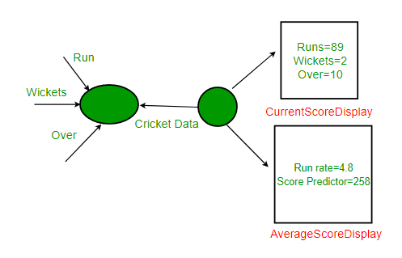

# Observer DesignPattern 


관찰자 패턴을 이해하기 위해 먼저 다음 시나리오를 고려해 봅시다.

**시나리오** :

현재 점수, 실행 률 등과 같은 정보를 시청자에게 알리는 크리켓 앱을 구축한다고 가정합니다. 현재 디스플레이 요소 CurrentScoreDisplay 및 AverageScoreDisplay를 두 개 만들었다 고 가정합니다. CricketData에는 모든 데이터 (런, 보울 등)가 있으며 데이터가 변경 될 때마다 표시 요소에 새 데이터가 통지되고 이에 따라 최신 데이터가 표시됩니다.



아래는 이 디자인의 자바 구현입니다.

```java
// Java implementation of above design for Cricket App. The 
// problems with this design are discussed below. 
  
// A class that gets information from stadium and notifies 
// display elements, CurrentScoreDisplay & AverageScoreDisplay 
class CricketData 
{ 
    int runs, wickets; 
    float overs; 
    CurrentScoreDisplay currentScoreDisplay; 
    AverageScoreDisplay averageScoreDisplay; 
  
    // Constructor 
    public CricketData(CurrentScoreDisplay currentScoreDisplay, 
                       AverageScoreDisplay averageScoreDisplay) 
    { 
        this.currentScoreDisplay = currentScoreDisplay; 
        this.averageScoreDisplay = averageScoreDisplay; 
    } 
  
    // Get latest runs from stadium 
    private int getLatestRuns() 
    { 
        // return 90 for simplicity 
        return 90; 
    } 
  
    // Get latest wickets from stadium 
    private int getLatestWickets() 
    { 
        // return 2 for simplicity 
        return 2; 
    } 
  
    // Get latest overs from stadium 
    private float getLatestOvers() 
    { 
        // return 10.2 for simplicity 
        return (float)10.2; 
    } 
  
    // This method is used update displays when data changes 
    public void dataChanged() 
    { 
        // get latest data 
        runs = getLatestRuns(); 
        wickets = getLatestWickets(); 
        overs = getLatestOvers(); 
  
        currentScoreDisplay.update(runs,wickets,overs); 
        averageScoreDisplay.update(runs,wickets,overs); 
    } 
} 
  
// A class to display average score. Data of this class is 
// updated by CricketData 
class AverageScoreDisplay 
{ 
    private float runRate; 
    private int predictedScore; 
  
    public void update(int runs, int wickets, float overs) 
    { 
        this.runRate = (float)runs/overs; 
        this.predictedScore = (int) (this.runRate * 50); 
        display(); 
    } 
  
    public void display() 
    { 
        System.out.println("\nAverage Score Display:\n" + 
                           "Run Rate: " + runRate + 
                           "\nPredictedScore: " + predictedScore); 
    } 
} 
  
// A class to display score. Data of this class is 
// updated by CricketData 
class CurrentScoreDisplay 
{ 
    private int runs, wickets; 
    private float overs; 
  
    public void update(int runs,int wickets,float overs) 
    { 
        this.runs = runs; 
        this.wickets = wickets; 
        this.overs = overs; 
        display(); 
    } 
  
    public void display() 
    { 
        System.out.println("\nCurrent Score Display: \n" + 
                           "Runs: " + runs +"\nWickets:"
                           + wickets + "\nOvers: " + overs ); 
    } 
} 
  
// Driver class 
class Main 
{ 
    public static void main(String args[]) 
    { 
        // Create objects for testing 
        AverageScoreDisplay averageScoreDisplay = 
                                       new AverageScoreDisplay(); 
        CurrentScoreDisplay currentScoreDisplay = 
                                       new CurrentScoreDisplay(); 
  
        // Pass the displays to Cricket data 
        CricketData cricketData = new CricketData(currentScoreDisplay, 
                                                  averageScoreDisplay); 
  
        // In real app you would have some logic to call this 
        // function when data changes 
        cricketData.dataChanged(); 
    } 
} 
```

```java
Current Score Display: 
Runs: 90
Wickets:2
Overs: 10.2

Average Score Display:
Run Rate: 8.823529
PredictedScore: 441
```

**위의 디자인 문제** **:**

- CricketData는 이러한 객체의 update 메소드 만 호출해야하는 경우에도 구체적인 표시 요소 객체에 대한 참조를 보유합니다. 필요한 것보다 너무 많은 추가 정보에 액세스 할 수 있습니다.
- 이 명령문“currentScoreDisplay.update (runs, wickets, overs);”는 가장 중요한 설계 원칙 인“구현이 아닌 인터페이스에 대한 프로그램”중 하나를 위반합니다. 추상 인터페이스가 아닌 데이터를 공유하기 위해 구체적인 객체를 사용하고 있기 때문입니다.
- 크리켓 데이터와 디스플레이 요소는 밀접하게 연결되어 있습니다.
- 미래에 또 다른 요구 사항이 발생하고 다른 표시 요소를 추가 해야하는 경우 코드의 비 변형 부분 (CricketData)을 변경해야합니다. 이것은 확실히 좋은 설계 관행이 아니며 응용 프로그램이 변경 사항을 처리하지 못하고 유지 관리하기 쉽지 않을 수 있습니다.

**이러한 문제를 피하는 방법?**
관찰자 패턴 사용

**관찰자 패턴**

관찰자 패턴을 이해하려면 먼저 주제 및 관찰자 객체를 이해해야합니다.

주제와 관찰자의 관계는 잡지 구독과 유사하게 쉽게 이해할 수 있습니다.

- 잡지 출판사 (제목)가 비즈니스에 있으며 잡지 (데이터)를 출판합니다.
- 당신이 (데이터 / 관찰자 사용자) 당신이 구독 (등록)하는 잡지에 관심이 있다면, 그리고 새로운 판이 출판되면 당신에게 전달됩니다.
- 구독을 취소하면 등록이 취소됩니다.
- 발행인은 자신이 누구인지, 잡지를 어떻게 사용하는지 알지 못하며 구독자 (느슨한 커플 링)이기 때문에 잡지를 전달합니다.

**정의:**

관찰자 패턴은 하나의 오브젝트가 상태를 변경하고 모든 종속 항목이 자동으로 통지되고 업데이트되도록 오브젝트 간의 일대 다 종속성을 정의합니다.

**설명:**

- 일대 다 의존성은 Subject (One)와 Observer (Many) 사이에 있습니다.
- 관찰자 자체가 데이터에 액세스 할 수 없으므로 종속성이 있습니다. 그들은 데이터를 제공하기 위해 주제에 의존합니다.

**수업 다이어그램 :**

이미지 출처 : [Wikipedia](https://en.wikipedia.org/wiki/Observer_pattern)

- 여기서 Observer와 Subject는 인터페이스입니다 (Java 인터페이스가 아닌 추상 슈퍼 유형 일 수 있음).
- 데이터가 필요한 모든 관찰자는 관찰자 인터페이스를 구현해야합니다.
- 옵저버 인터페이스의 notify () 메소드는 주제가 데이터를 제공 할 때 수행 할 조치를 정의합니다.
- 주체는 단순히 현재 등록 된 (구독 된) 옵저버의리스트 인 옵저버 콜렉션을 유지합니다.
- registerObserver (observer) 및 unregisterObserver (observer)는 각각 옵저버를 추가하고 제거하는 방법입니다.
- notifyObservers ()는 데이터가 변경되고 관찰자에게 새 데이터가 제공되어야 할 때 호출됩니다.

**장점 :**
상호 작용하는 객체간에 느슨하게 결합 된 디자인을 제공합니다. 느슨하게 결합 된 객체는 변화하는 요구 사항에 유연합니다. 여기서 느슨한 결합은 상호 작용하는 객체가 서로에 대한 정보가 적어야 함을 의미합니다.

관찰자 패턴은 다음과 같이이 느슨한 결합을 제공합니다.

- 대상은 관찰자가 관찰자 인터페이스를 구현한다는 것만 알고 있습니다.
- 관찰자를 추가하거나 제거하기 위해 주제를 수정할 필요가 없습니다.
- 주제와 관찰자 클래스를 서로 독립적으로 재사용 할 수 있습니다.

**단점 :**

- 관찰자의 명시 적 등록 및 등록 해제로 인해 [리스너 문제가](https://en.wikipedia.org/wiki/Lapsed_listener_problem) 발생하여 메모리 누수가 발생합니다 .

**이 패턴을 언제 사용합니까?**
여러 객체가 동일한 객체에 대해 깔끔하고 잘 테스트 된 디자인을 제공하므로 한 객체의 상태에 의존 할 때 응용 프로그램에서이 패턴을 사용하는 것을 고려해야합니다.

**실제 용도 :**

- GUI 툴킷 및 이벤트 리스너에서 많이 사용됩니다. 자바에서 버튼 (대상)과 onClickListener (관찰자)는 관찰자 패턴으로 모델링됩니다.
- 소셜 미디어, RSS 피드, 이메일 구독, 팔로우 또는 구독 옵션이 있으며 최신 알림을받습니다.
- Play 스토어에있는 앱의 모든 사용자는 업데이트가있을 경우 알림을받습니다.


## 참고

- https://www.geeksforgeeks.org/observer-pattern-set-1-introduction/