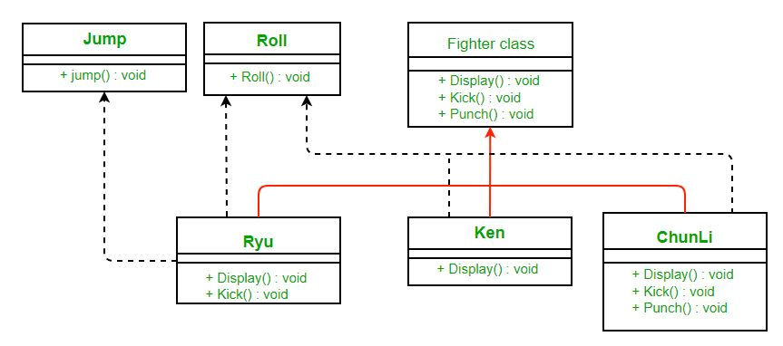
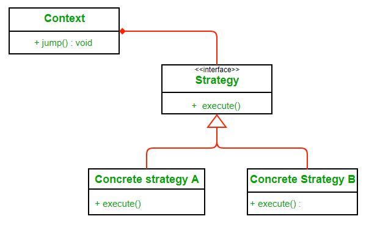
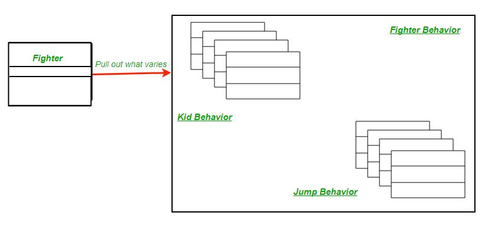
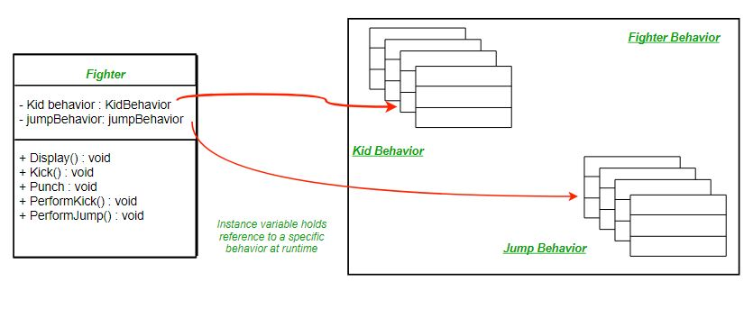
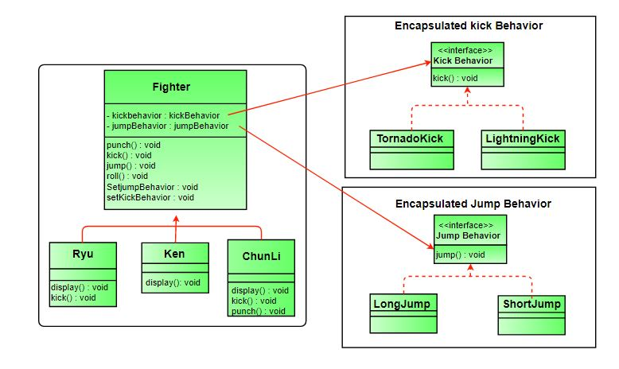

# Strategy DesignPattern

스트리트 파이터 게임을 구축한다고 가정 해 봅시다. 간단하게하기 위해 캐릭터가 킥, 펀치, 롤 및 점프라는 네 가지 움직임을 가질 수 있다고 가정합니다. 모든 캐릭터는 킥 앤 펀치 동작을 가지고 있지만 롤 과 점프는 선택 사항입니다. 초기에 상속을 사용하고  **Fighter** 클래스 의 공통 기능을 추상화하고 다른 캐릭터가 **Fighter** 클래스를 서브 클래스화 한다고 가정해봅시다.

**Fighter** 클래스는 기본 액션의 기본 구현을 갖습니다. 특수한 이동이있는 모든 캐릭터는 서브 클래스에서 해당 동작을 무시할 수 있습니다. 클래스 다이어그램은 다음과 같습니다.


**위 다이어그램의 문제점은 무엇일까?**

캐릭터가 점프 이동을 수행하지 않으면 어떻게됩니까? 여전히 슈퍼 클래스의 점프 동작을 상속합니다. 이 경우 점프를 무시하면 아무것도하지 않지만 많은 기존 클래스의 경우 그렇게해야 할 수도 있고 향후 클래스의 경우에도 처리해야 할 수도 있습니다. 이것은 또한 유지 보수를 어렵게 만듭니다. 그래서 여기서 상속을 사용할 수 없습니다.

**인터페이스는 어떤가요?**

## 다음 디자인을 살펴봅시다.

 

훨씬 더 깨끗합니다. **Fighter** 클래스 에서 일부 액션 (일부 캐릭터가 수행하지 못할 수도 있음)을 취해 인터페이스를 만들었습니다. 그렇게 해야만 점프할 수 있는 캐릭터만 **Jump동작**을 구현할 수 있습니다. 

**위 디자인의 문제점은 무엇일까?**

위 디자인의 주요 문제점은 코드 재사용입니다. 점프 앤 롤 동작의 기본 구현이 없으므로 코드 중복성이 있을 수 있습니다. 많은 서브 클래스에서 동일한 점프 동작을 반복해서 다시 작성해야 할 수도 있습니다.

**우리는 이것을 어떻게 피할 수 있을까?**

인터페이스 대신 **JumpBehavior** 및 **RollBehavior**  클래스를 만든 경우 어떻게 할까? 그렇다면 우리는 많은 문제로 인해 많은 언어에서 지원되지 않는 다중 상속을 사용해야합니다.

*여기 전략 패턴이 있습니다. 전략 패턴이 무엇인지 알아보고 적용해서 문제를 해결합니다..

**정의:**

Wikipedia는 전략 패턴을 다음과 같이 정의합니다.

*“컴퓨터 프로그래밍에서  **전략 패턴**  (**정책 패턴** 이라고도 함 )은 런타임에 알고리즘의 동작을 선택할 수있는 소프트웨어 디자인 패턴입니다. 전략 패턴은*

- *알고리즘 군을 정의하고*
- *각 알고리즘을 캡슐화하고*
- *그 제품군 내에서 알고리즘을 교환 할 수있게 합니다.”*


**다이어그램 :**

****

여기서 우리는 재사용을 위해 상속 대신 구성에 의존합니다. **컨텍스트**는 **전략** 으로 구성 됩니다. **컨텍스트**를 구현하는 대신 **컨텍스트는** 이를 **전략에** 위임합니다 . 컨텍스트는 동작 변경이 필요한 클래스입니다. 우리는 행동을 동적으로 바꿀 수 있습니다. **전략** 은 인터페이스로 구현되어 상황에 영향을 미치지 않으면 서 행동을 바꿀 수 있습니다.

전략 패턴을 사용하여 문제를 해결할 때 전략 패턴을 더 잘 이해할 수 있습니다.

**장점 :**

1. 알고리즘 계열은 클래스 계층 구조로 정의 할 수 있으며 아키텍처를 변경하지 않고 응용 프로그램 동작을 변경하기 위해 상호 교환 적으로 사용될 수 있습니다.
2. 알고리즘을 개별적으로 캡슐화하면 동일한 인터페이스를 준수하는 새로운 알고리즘을 쉽게 도입 할 수 있습니다.
3. 응용 프로그램은 런타임에 전략을 전환 할 수 있습니다.
4. 전략을 통해 클라이언트는 "switch"문 또는 일련의 "if-else"문을 사용하지 않고도 필요한 알고리즘을 선택할 수 있습니다.
5. 알고리즘 구현에 사용되는 데이터 구조는 전략 클래스에 완전히 캡슐화됩니다. 따라서 Context 클래스에 영향을주지 않고 알고리즘 구현을 변경할 수 있습니다.

**단점 :**

1. 응용 프로그램은 올바른 상황에 맞는 전략을 선택하기위한 모든 전략을 알고 있어야합니다.
2. 컨텍스트 및 전략 클래스는 일반적으로 추상 전략 기본 클래스에 지정된 인터페이스를 통해 통신합니다. 전략 기반 클래스는 일부 필수 전략 클래스가 구현하지 못할 수있는 모든 필수 동작에 대한 인터페이스를 제공해야합니다.
3. 대부분의 경우 애플리케이션은 필수 전략 오브젝트로 컨텍스트를 구성합니다. 따라서 응용 프로그램은 하나 대신 두 개의 오브젝트를 작성하고 유지 보수해야합니다.


Fighter 문제에 대해 전략 패턴을 적용하고 구현에 대해 생각해봅시다.

첫 번째 단계는 앞으로 여러 클래스에 따라 다를 수있는 동작을 식별하고 나머지 클래스와 분리하는 것입니다. 이 예에서는 킥과 점프 동작을 하도록 하겠습니다. 이러한 행동을 분리하기 위해 **Fighter** 클래스에서 두 가지 방법을 모두 꺼내고 각 행동을 나타내는 새로운 클래스 세트를 만듭니다.



Fighter 클래스는 이제 Fighter 클래스 또는 하위 클래스에 정의 된 킥 및 점프 방법을 사용하는 대신 킥 및 점프 동작을 위임합니다.



최종 수업 다이어그램을 재 작업 한 후
 

우리의 디자인을 전략 패턴의 정의와 킥 앤 점프 동작의 정의를 비교하는 것은 두 가지 알고리즘 계열입니다. 그리고 이러한 알고리즘은 구현에서 명백한 것으로 상호 교환 가능합니다.

아래는 동일한 Java 구현입니다.

```java
// Java program to demonstrate implementation of 
// Strategy Pattern 
  
// Abstract as you must have a specific fighter 
abstract class Fighter 
{ 
    KickBehavior kickBehavior; 
    JumpBehavior jumpBehavior; 
  
    public Fighter(KickBehavior kickBehavior, 
                   JumpBehavior jumpBehavior) 
    { 
        this.jumpBehavior = jumpBehavior; 
        this.kickBehavior = kickBehavior; 
    } 
    public void punch() 
    { 
        System.out.println("Default Punch"); 
    } 
    public void kick() 
    { 
        // delegate to kick behavior 
        kickBehavior.kick(); 
    } 
    public void jump() 
    { 
  
        // delegate to jump behavior 
        jumpBehavior.jump(); 
    } 
    public void roll() 
    { 
        System.out.println("Default Roll"); 
    } 
    public void setKickBehavior(KickBehavior kickBehavior) 
    { 
        this.kickBehavior = kickBehavior; 
    } 
    public void setJumpBehavior(JumpBehavior jumpBehavior) 
    { 
        this.jumpBehavior = jumpBehavior; 
    } 
    public abstract void display(); 
} 
  
// Encapsulated kick behaviors 
interface KickBehavior 
{ 
    public void kick(); 
} 
class LightningKick implements KickBehavior 
{ 
    public void kick() 
    { 
        System.out.println("Lightning Kick"); 
    } 
} 
class TornadoKick implements KickBehavior 
{ 
    public void kick() 
    { 
        System.out.println("Tornado Kick"); 
    } 
} 
  
// Encapsulated jump behaviors 
interface JumpBehavior 
{ 
    public void jump(); 
} 
class ShortJump implements JumpBehavior 
{ 
    public void jump() 
    { 
        System.out.println("Short Jump"); 
    } 
} 
class LongJump implements JumpBehavior 
{ 
    public void jump() 
    { 
        System.out.println("Long Jump"); 
    } 
} 
  
// Characters 
class Ryu extends Fighter 
{ 
    public Ryu(KickBehavior kickBehavior, 
               JumpBehavior jumpBehavior) 
    { 
        super(kickBehavior,jumpBehavior); 
    } 
    public void display() 
    { 
        System.out.println("Ryu"); 
    } 
} 
class Ken extends Fighter 
{ 
    public Ken(KickBehavior kickBehavior, 
               JumpBehavior jumpBehavior) 
    { 
        super(kickBehavior,jumpBehavior); 
    } 
    public void display() 
    { 
        System.out.println("Ken"); 
    } 
} 
class ChunLi extends Fighter 
{ 
    public ChunLi(KickBehavior kickBehavior, 
                  JumpBehavior jumpBehavior) 
    { 
        super(kickBehavior,jumpBehavior); 
    } 
    public void display() 
    { 
        System.out.println("ChunLi"); 
    } 
} 
  
// Driver class 
class StreetFighter 
{ 
    public static void main(String args[]) 
    { 
        // let us make some behaviors first 
        JumpBehavior shortJump = new ShortJump(); 
        JumpBehavior LongJump = new LongJump(); 
        KickBehavior tornadoKick = new TornadoKick(); 
  
        // Make a fighter with desired behaviors 
        Fighter ken = new Ken(tornadoKick,shortJump); 
        ken.display(); 
  
        // Test behaviors 
        ken.punch(); 
        ken.kick(); 
        ken.jump(); 
  
        // Change behavior dynamically (algorithms are 
        // interchangeable) 
        ken.setJumpBehavior(LongJump); 
        ken.jump(); 
    } 
} 
```

Output :

```jva
Ken
Default Punch
Tornado Kick
Short Jump
Long Jump
```


## 참고

- https://www.geeksforgeeks.org/strategy-pattern-set-1/
- https://www.geeksforgeeks.org/strategy-pattern-set-2/