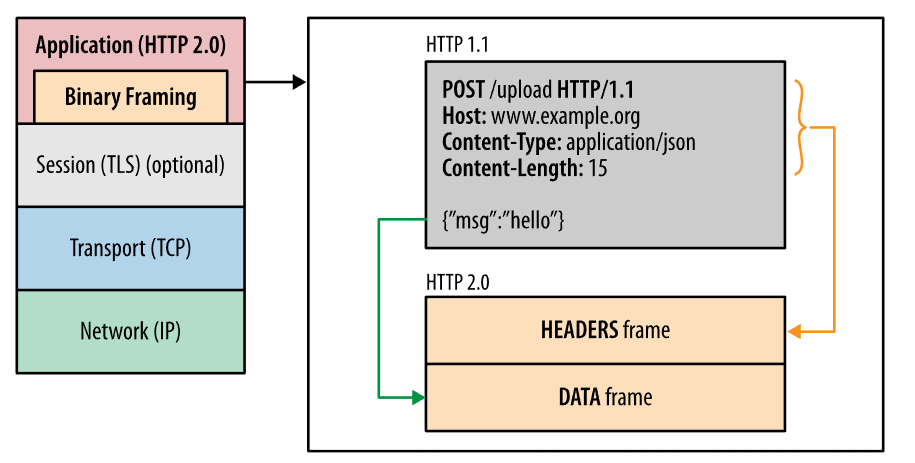
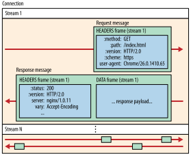
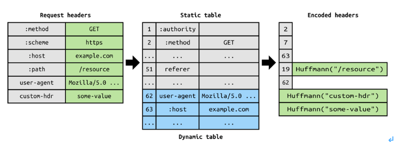
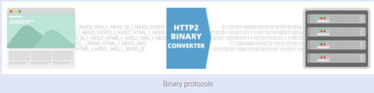
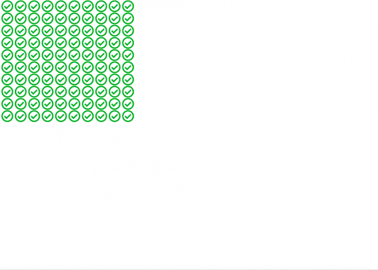
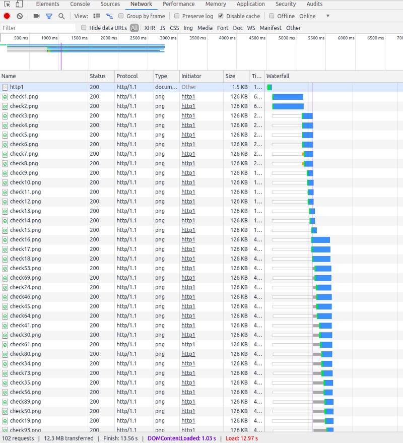
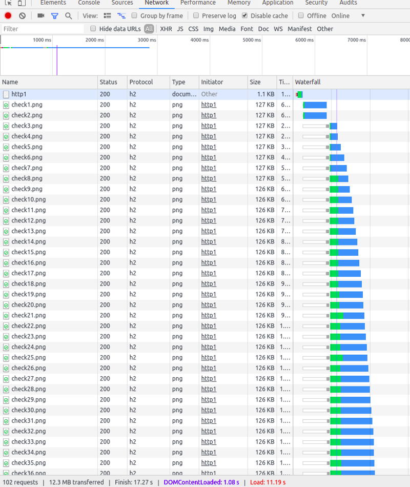
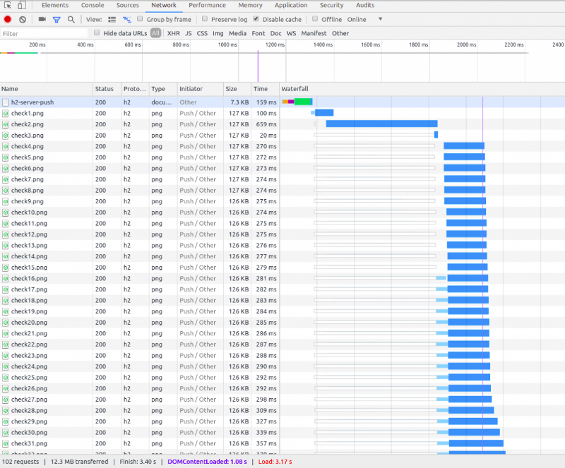
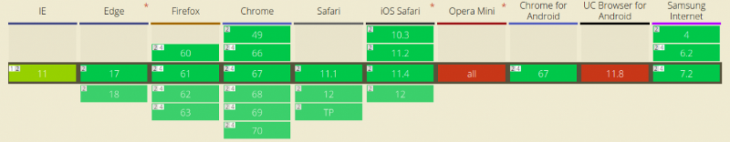

# HTTP/1에서 HTTP/3까지

## HTTP란 무엇인가?

**HTTP**(Hypertext Transfer Protocol)는 월드 와이드 웹 (World Wide Web)의 데이터 통신의 기초가 되는 응용 프로그램 프로토콜입니다.

**HTTP**는 클라이언트 / 서버 모델을 기반으로합니다. 클라이언트 / 서버 모델은 요청 및 응답을 통해 통신하는 두 대의 컴퓨터, 즉 클라이언트 (서비스 수신자) 및 서버 (서비스 공급자)로 설명 될 수 있습니다.

## HTTP/1

HTTP/1.1에의 통신 방식이다. 영속적인 커넥션 모델은 연속적인 요청 사이에 커넥션을 유지하여 새 커넥션을 여는데 필요한 시간을 줄입니다. HTTP 파이프라이닝은 한 단계 더 나아가, 응답조차도 기다리지 않고 연속적인 요청을 보내서 네트워크 지연을 더욱 줄입니다.

HTTP/1.1에서는 하나의 Connection당 하나의 요청을 처리 한다. 동시 전송이 불가능하고 순차적으로 통신하게 된다.

> 요즘 브라우저들은 http/1.1이 단점을 극복하기 위해 다수의 Connection을 생성해서 병렬로 요청을 보내지만 브라우저 별로 [Domain당 Connection개수의 제한](http://www.browserscope.org/?category=network&v=top)이 존재합니다.

그렇다 보니 다수의 리소스를 처리하려면  Latency가 길어지게 된다.

HTTP/1의 단점은 아래와 같다

- HOL (Head Of Line) Blocking - 특정 응답의 지연
- RTT( Round Trip Time ) 증가

## HTTP/2

2015년에 IETF (Internet Engineering Task Force)는 가장 유용한 인터넷 프로토콜 인 HTTP의 두 번째 주요 버전 인 HTTP/2를 출시합니다. 그것은 이전의 실험 SPDY 프로토콜에서 파생되었습니다.

### HTTP/2 개발의 주요 목표

- 프로토콜 협상 메커니즘 - 프로토콜 선택, 예. HTTP / 1.1, HTTP / 2 또는 기타.
- HTTP / 1.1과의 높은 수준의 호환성 - 메소드, 상태 코드, URI 및 헤더 필드
- 페이지 로딩 속도 향상
- 요청 헤더 압축
- 이진 프로토콜
- HTTP/2 서버 푸시
- 단일 TCP 연결을 통해 요구 다중화
- 파이프 라인을 요구하는
- HOL 차단 (Head-of-Line) - 패키지 차단

## HTTP/2 바이너리 프레이밍 계층

HTTP/1.1에서는 하나의 묶음으로 보내는 형태지만 HTTP/2에서는 **HEADERS frame과 DATA frame**으로 나뉜다. 이들은 바이너리 형식으로 인코딩되어 처리 된다.

### 스트림, 메시지 및 프레임

새로운 바이너리 프레이밍 계층이 도입됨으로써 데이터 교환 방식이 변경되었습니다.

- 스트림 : 구성된 연결 내에서 전달되는 바이트의 양방향 흐름이며, 하나 이상의 메시지가 전달될 수 있습니다.
- 메시지 : 논리적 요청 또는 응답 메시지에 매핑되는 프레임의 전체 시퀀스입니다.
- 프레임 : HTTP/2에서 통신의 최소 단위이며 각 최소 단위에는 하나의 프레임 헤더가 포함됩니다. 이 프레임 헤더는 최소한으로 프레임이 속하는 스트림을 식별합니다.

이러한 용어의 관계는 다음과 같이 요약됩니다.

- 모든 통신은 단일 TCP 연결을 통해 수행되며 전달될 수 있는 양방향 스트림의 수는 제한이 없습니다.
- 각 스트림에는 양방향 메시지 전달에 사용되는 고유 식별자와 우선순위 정보(선택 사항)가 있습니다.
- 각 메시지는 하나의 논리적 HTTP 메시지(예: 요청 또는 응답)이며 하나 이상의 프레임으로 구성됩니다.
- 프레임은 통신의 최소 단위이며 특정 유형의 데이터(예: HTTP 헤더, 메시지 페이로드 등)를 전달합니다. 다른 스트림들의 프레임을 인터리빙한 다음, 각 프레임의 헤더에 삽입된 스트림 식별자를 통해 이 프레임을 다시 조립할 수 있습니다.

간단히 말해, HTTP/2는 HTTP 프로토콜 통신을 바이너리 인코딩된 프레임의 교환으로 세분화합니다. 그런 다음 이 프레임은 특정 스트림에 속하는 메시지에 매핑되며, 모든 프레임은 단일 TCP 연결 내에서 다중화됩니다. HTTP/2 프로토콜이 제공하는 다른 모든 기능과 성능 최적화는 이러한 기반을 통해 지원됩니다.

### 멀티플렉싱 요청

HTTP/2는 단일 TCP 연결을 통해 여러 데이터 요청을 병렬로 보낼 수 있습니다. 이것은 한 서버에서 비동기 적으로 웹 파일을 다운로드 할 수 있기 때문에 HTTP/2 프로토콜의 가장 진보 된 기능입니다. 대부분의 최신 브라우저는 하나의 서버에 대한 TCP 연결을 제한합니다.

내부적인 구조를 좀더 자세히 살펴보겠습니다.

이 스냅샷은 동일한 연결 내의 여러 스트림을 캡처한 것입니다. 

HTTP 메시지를 독립된 프레임으로 세분화하고 이 프레임을 인터리빙한 다음, 다른 쪽에서 다시 조립하는 기능은 HTTP/2에서 가장 중요한 기능 향상입니다. 

HTTP/2의 새 바이너리 프레이밍 계층을 사용하면 HTTP/1.x에서 발생하는 문제인 추가 왕복 시간 (RTT)와 HOL(Head-of-Line) 차단을 해결할 수 있으며, 여러 개의 연결이 없어도 요청 및 응답의 병렬 처리와 전달을 지원할 수 있습니다. 또한 더 적은 연결을 사용하므로 전체 연결 경로(즉, 클라이언트, 중개 장치 및 원본 서버)에서 메모리와 처리량이 줄어듭니다. 그 결과 전체 운영 비용이 절감되고 네트워크 활용도와 용량이 개선됩니다. 따라서 HTTP/2로 전환하면 네트워크 지연 시간이 줄어들 뿐만 아니라 처리량이 개선되고 운영 비용이 줄어듭니다.

> 참고: 연결 수가 적다는 것은 HTTPS 배포의 성능을 개선하는데 특히 중요합니다. 연결 수가 적으면 값비싼 TLS 핸드셰이크가 줄어들고, 세션 재사용이 더 향상되며, 필요한 클라이언트 및 서버 리소스가 감소합니다.

### 스트림 우선순위 지정

HTTP/2 표준에서는 각 스트림이 연관된 가중치와 종속성을 갖도록 허용합니다.

- 각 스트림에는 1~256 사이의 정수 가중치가 할당될 수 있습니다.
- 각 스트림에는 다른 스트림에 대한 명시적 종속성이 부여될 수 있습니다.

스트림의 종속성 및 가중치 조합을 이용하여 클라이언트가 '우선순위 지정 트리'를 구성하고 통신할 수 있습니다. 이 트리는 클라이언트가 선호하는 응답 수신 방식을 나타냅니다. 그러면, 서버가 이 정보를 사용하여 CPU, 메모리 및 기타 리소스의 할당을 제어함으로써 스트림 처리의 우선순위를 지정합니다. 응답 데이터가 있는 경우, 서버는 우선순위가 높은 응답이 클라이언트에 최적으로 전달되도록 대역폭을 할당합니다.

HTTP/2 내에서 스트림 종속성은 또 다른 스트림의 고유 식별자를 상위 요소로 참조하는 방식으로 선언됩니다. 이 식별자가 생략되면 스트림이 '루트 스트림'에 종속됩니다. 스트림 종속성 선언은 가능하면 상위 요소 스트림에 종속성보다 리소스가 먼저 할당되어야 함을 나타냅니다. 즉, '응답 C보다 먼저 응답 D를 처리하고 전달해야 합니다'라는 의미입니다.

동일한 상위 요소를 공유하는 스트림(즉, 동위 요소 스트림)은 그 가중치에 비례하여 리소스가 할당되어야 합니다. 예를 들어, 스트림 A의 가중치가 12이고 그 동위 요소 스트림 B의 가중치가 4인 경우, 이들 스트림이 각각 수신해야 하는 리소스의 비율을 구하려면:

1. 모든 가중치를 더합니다. `4 + 12 = 16`
2. 각 스트림 가중치를 총 가중치로 나눕니다. `A = 12/16, B = 4/16`

따라서 스트림 A는 가용 리소스의 3/4를 수신하고 스트림 B는 1/4을 수신해야 하며, 스트림 B는 스트림 A에 할당된 리소스의 1/3을 수신해야 합니다. 위의 이미지에서 몇 가지 실습 예시를 더 살펴보겠습니다. 왼쪽에서 오른쪽으로:

1. 스트림 A나 스트림 B는 상위 요소 종속성을 지정하지 않고 암시적 '루트 스트림'에 종속됩니다. 스트림 A는 가중치가 12이고 B는 가중치가 4입니다. 따라서 비례 가중치에 따라 스트림 B는 스트림 A에 할당된 리소스의 1/3을 수신해야 합니다.
2. 스트림 D는 루트 스트림에 종속되고 C는 D에 종속됩니다. 따라서 D는 C보다 먼저 전체 리소스를 할당받아야 합니다. 가중치는 중요하지 않은데 그 이유는 C의 종속성이 더 높은 우선권을 갖기 때문입니다.
3. 스트림 D는 C보다 먼저 전체 리소스를 할당받아야 하며, 스트림 C는 A 및 B보다 먼저 전체 리소스를 할당받아야 하고, 스트림 B는 스트림 A에 할당된 리소스의 1/3을 수신해야 합니다.
4. 스트림 D는 E 및 C보다 먼저 전체 리소스를 할당받아야 하고, E 및 C는 A 및 B보다 먼저 똑같은 리소스를 할당받아야 하며, 스트림 A 및 B는 가중치에 비례하여 리소스를 할당받아야 합니다.

### 헤더 압축

각 HTTP 전송에서는 전송되는 리소스와 그 속성을 설명하는 헤더 세트를 전달합니다. HTTP/1.x의 경우 이 메타데이터는 항상 일반 텍스트로 전송되고, 전송당 500~800바이트의 오버헤드가 추가되며, HTTP 쿠키를 사용할 경우 수 KB가 추가되기도 합니다. ([프로토콜 오버헤드 측정 및 제어](https://hpbn.co/http1x/#measuring-and-controlling-protocol-overhead) 참조) 이 오버헤드를 줄이고 성능을 개선하기 위해 HTTP/2에서는 HPACK 압축 형식을 사용하여 요청 및 응답 헤더 메타데이터를 압축합니다. 이 압축 형식에서는 단순하지만 강력한 두 가지 기술을 사용합니다.

1. 전송되는 헤더 필드를 정적 Huffman 코드로 인코딩하도록 허용합니다. 이 코드는 필드의 개별 전송 크기를 줄여줍니다.
2. 이전에 표시된 헤더 필드의 색인 목록을 클라이언트와 서버가 유지하고 업데이트하도록 요구합니다(즉, 공유 압축 컨텍스트를 구성합니다). 그런 다음, 이 목록을 참조로 사용하여 이전에 전송된 값을 효율적으로 인코딩할 수 있습니다.

Huffman 코딩을 사용하면 전송 시에 개별 값을 압축할 수 있으며, 이전에 전송된 값의 인덱스 목록을 사용하면 중복 값을 인코딩할 수 있습니다. 그러기 위해 전체 헤더 키와 값을 효율적으로 조회하고 재구성하는 데 사용되는 색인 값을 전송합니다.

더 나은 최적화를 위해 HPACK 압축 컨텍스트는 정적 및 동적 테이블로 구성됩니다. 정적 테이블은 사양에 정의되며, 모든 연결에 사용될 가능성이 있는 공용 HTTP 헤더 필드를 제공합니다(예: 올바른 헤더 이름). 동적 테이블은 처음에는 비어있으며, 특정 연결에서 교환되는 값에 따라 업데이트됩니다. 따라서 아직까지 나타나지 않은 값에 대해 정적 Huffman 코딩을 사용하고 또한 정적 테이블이나 동적 테이블에 이미 있는 값을 인덱스로 대체하여 각 요청의 크기를 줄일 수 있습니다.

HTTP/2에선 Header에 중복값이 존재하는 경우 **Static/Dynamic Header Table** 개념을 사용하여 중복 Header를 검출하고 중복된 Header는 index값만 전송하고 중복되지 않은 Header정보의 값은  **Huffman Encoding** 기법으로 인코딩 처리 하여 전송한다.

### 이진 프로토콜

최신 HTTP 버전은 텍스트 프로토콜에서 바이너리 프로토콜로 변환하는 것과 같은 기능 및 특성 측면에서 크게 발전했습니다. 요청 - 응답주기를 완료하기 위해 텍스트 명령을 처리하는 데 사용되는 HTTP1.x입니다. HTTP/2는 동일한 태스크를 실행하기 위해 1 및 0의 2 진 명령을 사용합니다. 이 속성은 프레이밍과 관련된 복잡성을 줄이고 텍스트와 선택적 공백이 포함 된 명령으로 인해 혼동스럽게 혼합 된 명령의 구현을 단순화합니다.

HTTP/2 구현을 사용하는 브라우저는 동일한 텍스트 명령을 네트워크를 통해 전송하기 전에 바이너리로 변환합니다.

장점:

- 데이터 분석시 오버 헤드가 적습니다. 이는 HTTP/2와 HTTP1의 중요한 가치 제안입니다.
- 오류가 발생하지 않습니다.
- 네트워크의 공간 절약화.
- 효과적인 네트워크 리소스 활용.
- 응답 분할 공격과 같은 HTTP1.x의 텍스트 특성과 관련된 보안 문제를 제거합니다.
- 압축, 다중화, 우선 순위 지정, 흐름 제어 및 TLS의 효과적인 처리를 포함하여 HTTP/2의 다른 기능을 사용 가능하게합니다.
- 보다 쉬운 처리 및 구현을위한 컴팩트 한 명령 표현.
- 클라이언트와 서버 간의 데이터 처리면에서 효율적이고 견고합니다.
- 네트워크 대기 시간 감소 및 처리량 향상.

### HTTP/2 서버 푸시

HTTP/2에 새로 추가된 또 다른 강력한 기능은 서버가 단일 클라이언트 요청에 대해 여러 응답을 보낼 수 있다는 것입니다. 즉, 서버는 원래 요청에 응답할 뿐만 아니라 클라이언트가 명시적으로 요청하지 않아도 서버가 추가적인 리소스를 클라이언트에 푸시할 수 있습니다.

이러한 메커니즘이 브라우저에 필요한 이유는 무엇인가요? 일반적인 웹 애플리케이션은 여러 개의 리소스로 구성되며 이 모든 리소스는 서버가 제공하는 문서를 검사하는 방식으로 클라이언트에 의해 검색됩니다. 그러므로 지연 시간을 더 줄이고 서버가 연결된 리소스를 미리 푸시할 수 있도록 해보세요. 서버는 어떤 리소스가 클라이언트에 필요한지 이미 알고 있습니다. 이것이 바로 서버 푸시입니다.

실제로, 여러분이 데이터 URI를 통해 CSS, 자바스크립트 또는 기타 자산을 인라인 처리한 적이 있다면([리소스 인라인 처리](https://hpbn.co/http1x/#resource-inlining) 참조), 이미 서버 푸시를 체험한 것입니다. 우리는 클라이언트가 요청하기를 기다리지 않고 수동으로 리소스를 문서에 인라인 처리하여 해당 리소스를 클라이언트에 푸시하고 있습니다. HTTP/2의 경우 실현되는 결과는 동일하지만 추가적인 성능상의 이점이 있습니다. 푸시 리소스는 다음과 같을 수 있습니다.

- 클라이언트에 의해 캐시됨
- 다른 페이지에서 재사용
- 다른 리소스와 함께 다중화
- 서버에서 우선 순위 지정
- 클라이언트에 의한 거부

이러한 메커니즘의 간단한 쇼케이스로 간단한 예제 페이지를 만들었습니다.

여기에있는 것은 HTTP/1.1 HTTP/2 및 HTTP/2 서버 푸시를 설명하는 데 사용하는 100개의 검사 이미지가 포함 된 간단한 페이지입니다.

위의 그림에서주의해야 할 것은, 요청 수,로드 시간 프로토콜 열 초기화 프로그램 열 및 폭포 그림 자체입니다

#### For HTTP/1.1:

요청 수 : 102

로드 시간 : 12.97 초

프로토콜 : "http / 1.1"

초기 열 : 첫 번째 초기자는 사용자/클라이언트에서 나머지 요청은 다른 자원 (이 경우 이미지)가 필요하다는 것을 인식 한 클라이언트에 대한 응답에 의해 시작됩니다.

폭포 그림 : 여러 배치를 통해 요청이 어떻게 이루어지고 있는지 (TCP 연결)을 확인할 수 있습니다.

#### For HTTP/2:

요청 수 : 102

로드 시간 : 11.19s

프로토콜 : "h2"(HTTP/2)

초기 열 : 첫 번째 초기자는 사용자 / 클라이언트이며, 나머지 요청은 다른 자원 (이 경우 이미지)가 필요하다는 것을 인식 한 클라이언트에 대한 응답에 의해 시작됩니다.

폭포 그림 : 두 개의 일괄 처리 (TCP 연결)를 통해 요청이 어떻게 이루어지고 있는지를 볼 수 있습니다.

로드 시간에주의하십시오. 이 경우, 그것은 HTTP / 1.1 예 로딩 시간보다 조금 낮지 만, 반드시 그런 필요는 없습니다. 이 예는 클라이언트 요청의 다중화를 보여줍니다.

#### HTTP/2 server push:

요청 수 : 102

로드 시간 : 3.17 초

프로토콜 : "h2"(HTTP/2)

초기 열 : 첫 번째 초기자는 사용자 / 클라이언트에서 나머지 요구는 서버 푸시에 의해 시작됩니다 (실질적으로 하나의 요청 / 응답 사이클).

폭포 그림 : 1 배치 (1 TCP 연결)에서 요청이 어떻게 행해지는지를 볼 수 있습니다.

### 브라우저 호환성

최근의 대부분의 브라우저는 Opera mini (모든 버전) 및 UC Browser for Android를 제외하고 HTTP/2 프로토콜을 완벽하게 지원하고 있습니다. IE11과 같이 부분적으로 지원되는 것 (연두색)도 있습니다.

[브라우저 지원 자세한 내용]( https://caniuse.com/#feat=http2 )을 확인할 수 있습니다

### HTTP/2를 사용하여 사이트의 속도

HTTP / 2는 HTTP / 1.1의 문제를 완화하는 많은 새로운 구조와 당신의 Web 페이지의 성능을 향상시키는 것을 제공합니다. 현재 Web 클라이언트에 의해 광범위하게 지원되기 때문에, 그 구현은 간단합니다. HTTP / 2 프로토콜의 구현은 간단하지만, 그것을 사용하면이 프로토콜의 가능성을 최대한 활용하기 위해 (클라이언트에 자산의 제공 등) 메커니즘을 변경할 필요가 있다는 점에 유의할 필요가 있습니다.

## QUIC (Quick UDP Internet Connection)

구글에서 QUIC라는 프로토콜 설계하였고 2013년 6월 공개 하였고국제 인터넷 표준화 기구 (IETF)에 QUIC 프로토콜 표준화를 제안하였다.

Google-QUIC은 오로지 HTTP만 전송했으나 IETF QUIC 워킹 그룹을 통해 IETF-QUIC 은 TLS 1.3의 암호화 보안을 적용해 개선하였다.

### TCP HOL(head of line) 블로킹

HTTP/2는 TCP를 사용하며 이전 HTTP 버전을 사용할 때 보다 더 적은 TCP 연결을 사용한다. TCP는 신뢰할 수 있는 전송 프로토콜이고 기본적으로 두 머신 간의 가상 체인으로 생각해도 된다. 네트워크의 한쪽 끝에 넣은 것이 최종적으로 다른 쪽 끝에 같은 순서로 나올 것이다.(아니면 연결이 끊어진다.)

HTTP/2를 사용하는 일반적인 브라우저는 TCP 연결 한개로 수십, 수백 개의 병렬 전송을 한다.

HTTP/2로 통신하는 두 엔드포인트 사이 네트워크 어딘가에서 하나의 패킷이 빠지거나 없어진다면 없어진 패킷을 다시 전송하고 목적지를 찾는 동안 전체 TCP 연결이 중단되게 된다. 즉, TCP는 "체인"이기 때문에 한 링크가 갑자기 사라지면 그 링크 이후에 와야 하는 모든 것들이 기다려야 한다는 뜻이다. 패킷 손실률이 증가하면 HTTP/2의 성능도 저하된다. 손실률이 2%일때 HTTP/1 사용자가 더 나은 것으로 입증했다. 

#### 차단을 피하는 독립 스트림

QUIC에는 두 엔드포인트간에 연결을 안전하게 하고 데이터 전달을 신뢰할 수 있게 하는 연결 설정이 있다.

이 연결을 통해 두 가지 다른 스트림을 설정했을 때 이들을 독립적으로 다루므로 스트림 중 하나에서 어떤 링크가 사라지더라도 해당 스트림만(특정 체인) 멈추고 재전송될 없어진 링크를 기다란다.

다음은 두 엔드포인트간에 노란색과 파란색 스트림을 보내는 그림이다.

QUIC은 스트림의 순서 있는 전송을 보장하지만 스트림 사이에서는 (순서를) 보장하지 않는다. 스트림은 순서대로 데이터를 전송하고 유지하지만, 각 스트림은 애플리케이션이 보낸 것과는 다른 순서대로 목적지에 도착할 수 있다!

스트림 A와 B가 서버에서 클라이언트로 이동하는 예를 생각해 보자. 스트림 A를 먼저 시작하고 이어서 스트림 B를 시작했다. QUIC에서 잃어버린 패킷은 해당 패킷이 속한 스트림에만 영향을 준다. 스트림 A는 패킷을 잃어버렸지만 스트림 B는 잃어버리지 않았다면 스트림 A의 잃어버린 패킷을 다시 전송하는 동안 스트림 B는 계속해서 전송하면서 완료될 수 있다. 이는 HTTP/2에서는 불가능했다.

다음은 하나의 연결을 통해 두 QUIC 앤드포인트 사이에 보내진 노란색 스트림과 파란색 스트림의 그림이다. 이 두 스트림은 독립적이고 다른 순서로 도착할 것이지만 각 스트림은 신뢰할 수 있게 애플리케이션에 순서대로 전달된다.

### 프로토콜 기능

고수준에서 QUIC 프로토콜을 보자.

아래 그림은 HTTP를 전송할 때 HTTP/2 네트워크 스택을 왼쪽에 QUIC 네트워크 스택을 오른쪽에 보여준다.

QUIC은 UDP 위에 구현한 전송 프로토콜이다. 우리가 임의로 네트워크 트래픽을 보면 QUIC이 UDP 패킷으로 나타나는 것을 볼 것이다.

UDP에 기반을 둔 QUIC은 UDP 포트 번호를 사용해서 주어진 IP 주소의 특정 네트워크 서비스를 식별한다.

현재 알려진 모든 QUIC 구현체는 사용자 영역에 있으므로 커널 영역의 구현체보다 훨씬 빠른 발전이 가능하다.

UDP가 데이터 전송의 신뢰성을 보장하지 않지만, QUIC은 UDP 위에 새로운 계층을 추가함으로써 신뢰성을 제공한다. 추가된 계층은 TCP에 존재하는 패킷 재전송, 혼잡 제어, 속도 조정 및 다른 기능들을 제공한다.

한 엔드포인트로부터 QUIC을 통해 전송된 데이터는 연결이 유지되는 한 다른 엔드포인트에서 수신할 수 있다.

### TLS 1.3

QUIC에서 사용하는 전송 보안은 TLS 1.3([RFC 8446](https://tools.ietf.org/html/rfc8446))이며 암호화하지 않은 QUIC 연결은 절대로 존재하지 않는다.

이전 버전의 TLS와 비교해서 TLS 1.3에 몇몇 장점이 있지만 QUIC이 TLS 1.3을 사용한 주된 이유는 핸드쉐이크에 더 적은 라운드 트립이 필요하도록 바뀌었기 때문이다. 이는 프로토콜 지연을 줄여준다.

QUIC의 Google 레거시 버전은 커스텀 암호화를 사용했다.

### QUIC을 통한 HTTP/3

HTTP/3라고 부르는 HTTP 계층은 HTTP 형태의 전송을 한다. 그 중에는 HPACK이라 부르는 HTTP/2 헤더 압축과 비슷한 QPACK을 사용한 HTTP 헤더 압축도 있다.

HPACK 알고리즘은 *순차적인* 스트림 전달에 의존하는데 QUIC은 스트림을 순서 없이 전달할 수 있으므로 HPACK을 수정하지 않고는 HTTP/3에서 재사용할 수 없다. [HPACK](https://httpwg.org/specs/rfc7541.html)을 QUIC에 맞게 수정한 것을 QPACK이라 볼 수 있다.

### 연결

QUIC 연결은 두 QUIC 엔드포인트 사이의 대화이다. QUIC의 연결 설정은 버전 협상, 암호화, 전송 핸드쉐이크로 구성되어 있으므로 연결 설정의 지연시간을 줄여준다.

이러한 연결을 통해 실제 데이터를 보내려면 하나 이상의 스트림을 만들어서 사용해야 한다.

#### 연결 ID

각 연결은 연결 식별자나 연결 ID를 가지므로 이를 통해 연결을 식별한다. 엔드포인트가 자유롭게 연결 ID를 선택한다. 각 엔드포인트는 엔드포인트의 피어가 사용할 연결 ID를 선택한다.

이 연결 ID의 주요 기능은 하위 프로토콜 계층(UDP, IP 혹은 그 아래 계층)에서 주소가 변경되더라도 QUIC 연결의 패킷이 잘못된 엔드포인트로 전달되지 않도록 보장하는 것이다.

연결 ID를 이용하면 TCP에서는 불가능했던 방법으로 IP 주소와 네트워크 인터페이스 사이에서 연결이 마이그레이션 할 수 있다. 예를 들면 사용자가 자신의 기기를 들고 wifi가 지원되는 곳으로 이동했을 때 다운로드를 진행하면서 셀룰러 네트워크 연결에서 더 빠른 wifi 연결로 변경되는 것이 이 마이그레이션을 통해 가능하다. 마찬가지로 wifi를 이용할 수 없게 되었을 때 셀룰러 연결을 통해 다운로드를 진행할 수 있다.

#### 포트 번호

QUIC이 UDP 위에 만들어졌으므로 들어오는 연결을 구분하기 위해 16비트 포트 번호 필드를 사용한다.

#### 버전 협상

클라이언트는 QUIC 연결 요청에서 어떤 QUIC 프로토콜 버전으로 통신하고 싶은지 서버에게 알려주고 서버는 클라이언트가 선택할 수 있도록 지원하는 버전 목록을 응답한다.

### HTTP/3과 HTTP/2의 비교

HTTP/3는 자체적으로 스트림을 다루는 전송 프로토콜인 QUIC을 위해 설계되었다.

HTTP/2는 TCP를 위해 설계되었으므로 HTTP 계층에서 스트림을 다룬다.

#### 유사점

이 두 프로토콜을 사실상 같은 기능을 제공한다.

- 두 프로토콜은 스트림을 제공한다.
- 두 프로토콜은 서버 푸시를 지원한다
- 두 프로토콜은 헤더 압축을 제공한다. QPACK과 HPACK은 설계상 비슷하다.
- 두 프로토콜은 스트림을 이용해서 하나의 연결을 통해 멀티플랙싱을 제공한다.
- 두 프로토콜은 스트림에 우선순위를 정한다.

#### 차이점

세부 내용에 차이점이 있는데 주로 HTTP/3의 QUIC 사용 때문에 생긴다.

- QUIC의 0-RTT 핸드쉐이크 덕에 HTTP/3에서는 이른 데이터 지원이 더 낫게 잘 동작한다. TCP Fast Open과 TLS는 더 적은 데이터를 보내지만, 종종 문제점에 직면한다.
- HTTP/3는 QUIC 덕에 TCP + TLS보다 훨씬 더 빠른 핸드쉐이크를 제공한다.
- HTTP/3에는 안전하지 않거나 암호화되지 않은 버전이 없다. 인터넷에서 드물기는 하지만 HTTP/2는 HTTPS 없이 구현하고 사용할 수 있다.
- HTTP/2가 ALPN 확장을 이용하여 즉시 TLS 핸드쉐이크 협상을 완료할 수 있는 반면 HTTP/3는 QUIC을 사용하므로 클라이언트에 이 사실을 알리기 위해 `Alt-Svc:` 헤더 응답이 먼저 있어야 한다.

## 참고

- https://medium.com/@factoryhr/http-2-the-difference-between-http-1-1-benefits-and-how-to-use-it-38094fa0e95b
- https://developers.google.com/web/fundamentals/performance/http2/?hl=ko
- [https://www.popit.kr/%EB%82%98%EB%A7%8C-%EB%AA%A8%EB%A5%B4%EA%B3%A0-%EC%9E%88%EB%8D%98-http2/](https://www.popit.kr/나만-모르고-있던-http2/)
- https://developer.mozilla.org/ko/docs/Web/HTTP/Connection_management_in_HTTP_1.x
- https://http3-explained.haxx.se/ko/