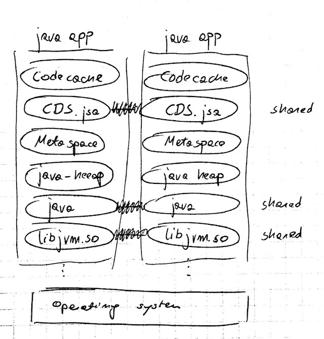

# Java 12 Class Data Sharing

> Java12에 기본으로 설정된 CDS에 대해 알아본다.


## Class Data Sharing란 무엇입니까?

클래스 데이터 공유는 여러 JVM이 공유 메모리를 통해로드 된 클래스 (및 다른 것들)를 공유 할 수있게 해주는 JVM 기능입니다.

[Java 1.5부터 Sun JVM](https://docs.oracle.com/javase/1.5.0/docs/guide/vm/class-data-sharing.html)에서 기본 CDS를 사용할 수있었습니다. 시스템 클래스와 직렬 GC로만 제한되어 있으므로 널리 적용 할 수 없습니다. Oracle JDK 9에서는 다른 GC 알고리즘 및 응용 프로그램 클래스를 지원하므로 유용합니다. 오픈 소스가 된 JDK 10까지 [상용 기능](http://openjdk.java.net/jeps/310)이었습니다.

CDS는 지정된 클래스의 내부 표현을 캐싱하여 메모리 매핑 파일을 만듭니다. 따라서이 파일 (및 해당 메모리)을 JVM간에 공유 할 수 있으며 내부 표현의 클래스로드가 일반 jar 파일보다 빠릅니다.



IBM Open J9는 오랜 기간 동안 [비슷한 기능](https://www.ibm.com/support/knowledgecenter/SSYKE2_8.0.0/com.ibm.java.vm.80.doc/docs/shrc.html)을 가지고있었습니다.

이 블로그 포스트에서 우리는 그러한 CDS 아카이브를 준비하는 방법과 잠재적 이점을 살펴볼 것입니다. 우리는 elasticsearch docker 이미지를 사용하여 실험을 수행 할 것입니다.


# CDS 준비

여기에 제시된 모든 코드는 [github에 게시됩니다](https://github.com/igor-kupczynski/class-data-sharing/tree/master/target) .


### 소개 - OpenJDK 10이 필요합니다.

elasticsearch docker 이미지를 사용하여 클래스 데이터 공유의 영향을 테스트 해 봅시다.

먼저 openjdk로 다시 패키지해야합니다.

```dockerfile
# Dockerfile-openjdk10
FROM docker.elastic.co/elasticsearch/elasticsearch-oss:6.2.4

COPY pkg/ /app/pkg

RUN cd /app/pkg && \
    tar -zxf openjdk-10.0.1_linux-x64_bin.tar.gz && \
    mkdir -p /opt/java && \
    mv jdk-10.0.1 /opt/java

ENV JAVA_HOME /opt/java/jdk-10.0.1
```

Makefile을 만듭니다. 우리가 갈수록 더 많은 것을 추가한다.

```makefile
# Makefile
.PHONY: help
help:
    @ echo "# Elasticsearch and Class Data Sharing (CDS) experiment"
    @ echo
    @ echo "build-jdk10         - repackage elasticsearch-oss with openjdk10"
    @ echo 
    @ echo "clean-cache         - nuke the class list and cache"
    @ echo "generate-class-list - list classes used by elasticsearch"
    @ echo "dump-class-cache    - dump the classes from the list to cache file"
    @ echo "build-cds           - repackge the class cache in the elasticsearch docker container"
    @ echo
    @ echo "run-{cds/nocds}     - run elasticsearch with/without class data sharing"
    @ echo

pkg/openjdk-10.0.1_linux-x64_bin.tar.gz:
    @ wget -P pkg https://download.java.net/java/GA/jdk10/10.0.1/fb4372174a714e6b8c52526dc134031e/10/openjdk-10.0.1_linux-x64_bin.tar.gz

pkg: pkg/openjdk-10.0.1_linux-x64_bin.tar.gz

.PHONY: build-jdk10
build-jdk10: pkg
    @ docker build -f Dockerfile-openjdk10 -t "ikupczynski/elasticsearch-oss:6.2.4-openjdk10" .
```

이제 우리는 다시 패키지 된 이미지를 얻을 수 있습니다.

```shell
make build-jdk10
```


## Markfile

### Elasticsearch에서 사용하는 클래스 목록 만들기

우리는 엘라스틱을 시작하여 간단한 요청에 응답하고 사용하는 모든 클래스를 -XX : DumpLoadedClassList = / app / cache / elasticsearch_appcds 파일에 기록하도록 할 것입니다. 우리는 특별히 -XX : + UseAppCDS를 사용하여 응용 프로그램 클래스에 대한 지원을 활성화해야합니다. 그렇지 않으면 jdk 클래스로만 제한됩니다.

```shell
CWD := $(shell pwd)

.PHONY: clean-cache
clean-cache:
    @ rm -rf cache/elasticsearch_appcds*
    @ echo "Nuked cache"

cache/elasticsearch_appcds.cls:
    @ touch cache/elasticsearch_appcds.cls
    @ export ES_JAVA_OPTS="-XX:+UseAppCDS \
            -XX:DumpLoadedClassList=/app/cache/elasticsearch_appcds.cls" && \
        docker run \
            -d --name generate-class-list \
            -p 9200:9200 -p 9300:9300 \
            -e "discovery.type=single-node" \
            -v $(CWD)/cache:/app/cache \
            --env ES_JAVA_OPTS \
            -it "ikupczynski/elasticsearch-oss:6.2.4-openjdk10"
    @ echo "Waiting until elasticsearch starts"
    @ bin/wait-on-elastic
    @ docker rm -f generate-class-list
    @ echo "Class list generated. Number of classes: "
    @ wc -l cache/elasticsearch_appcds.cls
```

우리는 background에서  `docker run -d` 를 입력 후  elasticsearch를 시작하고 다음 스크립트를 사용하여 요청에 응답 할 때까지 기다립니다.

```shell
until $(curl --output /dev/null --silent --head --fail localhost:9200); do
    printf '.'
    sleep 1
done
```

실행하면 `make cache/elasticsearch_appcds.cls`elasticsearch에서 사용하는 약 7,000 개의 클래스 목록을 얻습니다.

```shell
$ make cache/elasticsearch_appcds.cls
e2afbb966e1ad64d1296ada7c67a1038301834f8419aafa419ebbf74c7cd499b
Waiting until elasticsearch starts
...........generate-class-list
Class list generated. Number of classes:
    7111 cache/elasticsearch_appcds.cls

$ head -n 5 cache/elasticsearch_appcds.cls
java/lang/Object
java/lang/String
java/io/Serializable
java/lang/Comparable
java/lang/CharSequence

$ tail -n 5 cache/elasticsearch_appcds.cls
org/elasticsearch/common/io/Streams$FlushOnCloseOutputStream
org/elasticsearch/Version$DeclaredVersionsHolder
com/fasterxml/jackson/core/io/JsonStringEncoder
com/fasterxml/jackson/core/util/ByteArrayBuilder
org/elasticsearch/common/bytes/PagedBytesReference$1
```

이 목록은 앱이 실행되는 동안 생성된다는 점에 유의하십시오. 나중에 클래스를 수동으로로드하는 경우이 코드 경로를 사용해야합니다. 우리의 경우 우리는 elasticsearch가 간단한 휴식 요청에 응답 할 수있을 때까지 기다립니다. 이것은 완벽하지는 않지만 실험에 충분합니다.


### JVM 오류

일반적으로 다음 단계는 elasticsearch_appcds 클래스 목록을 사용하여 캐시 파일을 채우는 것이지만 일부 제한 (JVM 버그 또는 더 많은 메모리 제한 또는 docker-jvm 상호 작용 중 하나)이 발생했습니다. 클래스 목록을 1/7에서 약 6k 줄이기 위해 필요했습니다. 자세한 내용은 [error.org](https://github.com/igor-kupczynski/class-data-sharing/blob/master/error.org)를 참조하십시오.

```shell
# Workaround of the JVM error
cache/elasticsearch_appcds.cls-thin: cache/elasticsearch_appcds.cls
    @ head -n 6218 cache/elasticsearch_appcds.cls > cache/elasticsearch_appcds.cls-thin
    @ echo "Filtered the class list. Number of classes: "
    @ wc -l cache/elasticsearch_appcds.cls-thin

generate-class-list: cache/elasticsearch_appcds.cls-thin
```


### 클래스 캐시 미리 채우기

클래스 목록이 생겼으므로 이제이를 사용하여 클래스 캐시를 미리 채 웁니다. 이전 단계와는 달리 jvm은 앱을 실행하지 않습니다. 클래스 목록을 통해 각 클래스를로드하고 캐시 파일로 덤프하고 jvm을 중지하는 프로세스가 시작됩니다.

```shell
cache/elasticsearch_appcds.jsa: generate-class-list
    @ touch cache/elasticsearch_appcds.jsa
    @ export ES_JAVA_OPTS="-Xshare:dump \
            -XX:+UseAppCDS \
            -XX:SharedClassListFile=/app/cache/elasticsearch_appcds.cls-thin \
            -XX:+UnlockDiagnosticVMOptions \
            -XX:SharedArchiveFile=/app/cache/elasticsearch_appcds.jsa" && \
        docker run \
            --rm --name dump-class-cache \
            -e "discovery.type=single-node" \
            -v $(CWD)/cache:/app/cache \
            --env ES_JAVA_OPTS \
            -it "ikupczynski/elasticsearch-oss:6.2.4-openjdk10"

dump-class-cache: generate-class-list cache/elasticsearch_appcds.jsa
```

그것을 시도해봅시다.

```shell
$ make dump-class-cache
OpenJDK 64-Bit Server VM warning: Option UseConcMarkSweepGC was deprecated in version 9.0 and will likely be removed in a future release.
narrow_klass_base = 0x0000000800000000, narrow_klass_shift = 3
Allocated temporary class space: 1073741824 bytes at 0x00000008c0000000
Allocated shared space: 3221225472 bytes at 0x0000000800000000
Loading classes to share ...
(...)
Loading classes to share: done.
Rewriting and linking classes ...
Preload Warning: Removed error class: org.apache.logging.log4j.core.async.AsyncLoggerContext
Rewriting and linking classes: done
Number of classes 7211
    instance classes   =  7087
    obj array classes  =   116
    type array classes =     8
Updating ConstMethods ... done.
Removing unshareable information ... done.
Scanning all metaspace objects ...
Allocating RW objects ...
Allocating RO objects ...
Relocating embedded pointers ...
Relocating external roots ...
Dumping symbol table ...
Relocating SystemDictionary::_well_known_klasses[] ...
(...)
Removing java_mirror ... done.
mc  space:     18184 [  0.0% of total] out of     20480 bytes [ 88.8% used] at 0x0000000800000000
rw  space:  18630320 [ 22.6% of total] out of  18632704 bytes [100.0% used] at 0x0000000800005000
ro  space:  31856600 [ 38.6% of total] out of  31858688 bytes [100.0% used] at 0x00000008011ca000
md  space:      6160 [  0.0% of total] out of      8192 bytes [ 75.2% used] at 0x000000080302c000
od  space:  31914104 [ 38.7% of total] out of  31916032 bytes [100.0% used] at 0x000000080302e000
total    :  82425368 [100.0% of total] out of  82436096 bytes [100.0% used]
```

그리고 결과 파일은 사전 로드된 클래스의 `80Mb`입니다.

```shell
$ ls -lah cache/elasticsearch_appcds.jsa
-r--r--r--  1 igor  staff    79M May 20 20:52 cache/elasticsearch_appcds.jsa
```


### 컨테이너로 패키징

우리는 클래스 캐시를 가지고 있고, 이제 컨테이너와 함께 패키징할 수 있습니다.

다음은 도커 파일입니다.

```dockerfile
# Dockerfile-cds
FROM ikupczynski/elasticsearch-oss:6.2.4-openjdk10

COPY cache/ /app/cache
```

보시다시피 캐시를 용기에 복사하기만 하면 됩니다.

`Makefile` 추가 기능은 다음과 같습니다.

```makefile
CDS_IMAGE = ikupczynski/elasticsearch-oss:6.2.4-cds

.PHONY: build-cds
build-cds: dump-class-cache
    @ docker build -f Dockerfile-cds -t $(CDS_IMAGE) .
```

제가 이미지를 만들고 도커허브에 Push 했으니까 여기서부터 계속 하셔도 됩니다.

```shell
docker pull ikupczynski/elasticsearch-oss:6.2.4-cds
```


## 탄력적인 검색을 실행할 수 있는 편리한 대상

CDS를 사용하거나 사용하지 않고 탄력적인 검색을 실행할 수 있는 몇 가지 대상을 정의해 보겠습니다.

```shell
RUN_NO_CDS = export ES_JAVA_OPTS="-Xshare:off \
            -Xlog:class+load:file=/app/logs/classload-nocds.log " && \
        docker run \
            -e "discovery.type=single-node" \
            -v $(CWD)/cache:/app/cache \
            -v $(CWD)/logs:/app/logs \
            --env ES_JAVA_OPTS \
            -it 

.PHONY: clean-nocds-logs
clean-nocds-logs:
    @ rm -f logs/classload-nocds.log*

.PHONY: run-nocds
run-nocds: clean-nocds-logs
    @ $(RUN_NO_CDS) --rm $(CDS_IMAGE)

# `time-nocds` given mostly for illustration, it is not acurate
.PHONY: time-nocds
time-nocds:
    @ $(RUN_NO_CDS) -p 9200:9200 --name run-no-cds -d $(CDS_IMAGE)
    @ echo "Timing the wait on elastic"
    @ time bin/wait-on-elastic
    @ docker rm -f run-no-cds

RUN_CDS = export ES_JAVA_OPTS="-Xshare:on \
            -Xlog:class+load:file=/app/logs/classload-cds.log \
            -XX:+UseAppCDS \
            -XX:SharedClassListFile=/app/cache/elasticsearch_appcds.cls-thin \
            -XX:+UnlockDiagnosticVMOptions \
            -XX:SharedArchiveFile=/app/cache/elasticsearch_appcds.jsa" && \
        docker run \
            -e "discovery.type=single-node" \
            -v $(CWD)/cache:/app/cache \
            -v $(CWD)/logs:/app/logs \
            --env ES_JAVA_OPTS \
            -it

.PHONY: clean-cds-logs
clean-cds-logs:
    @ rm -f logs/classload-cds.log*

.PHONY: run-cds
run-cds:
    @ $(RUN_CDS) --rm $(CDS_IMAGE)

# `time-cds` given mostly for illustration, it is not acurate
.PHONY: time-cds
time-cds:
    @ $(RUN_CDS) -p 9200:9200 --name run-cds -d $(CDS_IMAGE)
    @ echo "Timing the wait on elastic"
    @ time bin/wait-on-elastic
    @ docker rm -f run-cds
```

이제 CDS를 사용하거나 사용하지 않고 탄력 검색을 실행할 수 있습니다.

```shell
make run-cds
make run-nocds
```


## 실험

### Classes가 어떻게 로드되는 방법

터미널에서 두 버전을 모두 실행한 다음 로그를 검사할 수 있습니다.

```shell
$ make time-nocds
# ...

$ make time-cds
# ...


$ grep 'org.elasticsearch.bootstrap.Bootstrap ' logs/*
logs/classload-cds.log:[1.370s][info][class,load] org.elasticsearch.bootstrap.Bootstrap source: shared objects file
logs/classload-nocds.log:[2.696s][info][class,load] org.elasticsearch.bootstrap.Bootstrap source: file:/usr/share/elasticsearch/lib/elasticsearch-6.2.4.jar
```

보시다시피 클래스 데이터 공유를 통해 `공유 개체 파일`에서 기본 클래스를 로드했습니다. 즉, 생성된 클래스 캐시를 의미합니다. `nocds`의 경우 파일이 jar에서 로드됩니다. 예상대로 나왔습니다.

또한 `cds` 버전이 메인 클래스를 1초 이상 더 빠르게 로드한 것을 볼 수 있습니다. 이 숫자는 제가 이 게시물을 작성하기 위해 수행한 여러 실행에서 상당히 일관되었습니다. 엄격한 벤치마크가 아니었기 때문에 믿을 수 없습니다. 고려해야 할 변수가 많은 개발 랩톱에서 실행되고 있습니다. Java 애플리케이션을 자주 시작(재시작)하는 경우 클래스 캐시를 생성하고 케이스/앱을 사용할 때의 시작 시간을 비교합니다.

또한 캐시에서 실제로 로드된 클래스의 수를 살펴보겠습니다.

```shell
$ grep -c 'shared objects file' logs/classload-cds.log
2028
```


### 메모리 사용량

먼저 클래스 데이터 공유 없이 시작하겠습니다.

```bash
$ make run-nocds  # 4 times, different terminals
# (...)


$ docker stats
CONTAINER ID        NAME                CPU %               MEM USAGE / LIMIT     MEM %               NET I/O             BLOCK I/O           PIDS
371268a8263b        vigilant_neumann    0.91%               1.168GiB / 7.787GiB   15.00%              858B / 0B           0B / 254kB          28
5137554b5e86        pensive_kepler      0.16%               1.164GiB / 7.787GiB   14.95%              858B / 0B           0B / 254kB          28
9fd0a493d7a2        vibrant_albattani   0.18%               1.174GiB / 7.787GiB   15.08%              858B / 0B           0B / 254kB          28
5cfb3f1d7a8e        vibrant_shtern      0.20%               1.17GiB / 7.787GiB    15.03%  
```

보고된 mem 사용량은 : `1.164`, `1.168`, `1.170`, `1.174 [GiB]`

그리고 클래스 데이터 공유도 가능합니다.

```bash
$ make run-cds  # 4 times
# (...)

$ docker stats
CONTAINER ID        NAME                       CPU %               MEM USAGE / LIMIT     MEM %               NET I/O             BLOCK I/O           PIDS
4e29db4f3dca        inspiring_volhard          0.97%               1.154GiB / 7.787GiB   14.82%              718B / 0B           8.19kB / 254kB      28
2841355336be        awesome_shockley           0.31%               1.153GiB / 7.787GiB   14.81%              788B / 0B           0B / 254kB          28
1fe95a004665        naughty_goldberg           0.39%               1.171GiB / 7.787GiB   15.04%              788B / 0B           0B / 254kB          28
513955f2d550        compassionate_montalcini   0.27%               1.152GiB / 7.787GiB   14.80%              968B / 0B           0B / 254kB          28
```

보고된 mem 사용량은 : `1.152`, `1.153`, `1.154`, `1.171 [GiB]`

다시 말씀드리지만, 벤치마크는 아니지만 `5-20 MiB`의 개선 효과를 볼 수 있습니다.


## 되풀이

클래스 데이터 아카이브를 생성하려면 다음을 수행해야 합니다.

1. 클래스 목록을 덤프하는 동안 응용 프로그램을 실행합니다.

```bash
-XX:+UseAppCDS -XX:DumpLoadedClassList=/class-list.cls
```

2. 이 목록에서 아카이브 파일을 생성합니다.

```bash
-Xshare:dump \
   -XX:+UseAppCDS \
   -XX:SharedClassListFile=/class-list.cls \
   -XX:+UnlockDiagnosticVMOptions \
   -XX:SharedArchiveFile=/archive.jsa  
```

3. 아카이브를 사용하여 앱을 실행합니다.

```bash
-Xshare:on \
   -XX:+UseAppCDS \
   -XX:SharedClassListFile=/class-list.cls \
   -XX:+UnlockDiagnosticVMOptions \
   -XX:SharedArchiveFile=/archive.jsa 
```

내부 표현은 아키텍처에 따라 다를 수 있으므로 대상에 가까운 환경에서 생성되어야 합니다.

그 결과 JVM 간에 수십 메가바이트의 Java 클래스를 공유할 수 있으며, 시작 시간부터 몇 초까지 단축할 수 있습니다. 탄력적인 조사의 경우, 이러한 것들은 큰 절감 효과가 없습니다. 반면, 시작 시간이 단축되면 UX가 크게 향상되는 여러 개의 앱 복사본을 실행하거나 스크립트인 경우 클래스 데이터 공유를 사용하는 것을 고려해야 합니다. 공교롭게도 서버 없는 플랫폼을 실행하면 이 두 가지 조건이 모두 적용됩니다.


## 결론

클래스 데이터 공유를 통해 시작 시간을 단축하고 메모리 사용량을 줄일 수 있습니다(여러 인스턴스를 실행하는 경우). Volker Simonis는 JRuby의 30%의 Statup Time 개선 사항을 보고합니다. 애플리케이션을 자주 시작하거나(예: 스크립트) 여러 복사본(조정, 서버 없음)을 실행해야 하는데 애플리케이션 클래스 공유에 대해 OpenJDK 10과 호환되는 경우 시도해 봅니다.


## Docs

Java 응용 프로그램의 시작 시간과 메모리 사용 공간을 줄이는 데 도움이되는 클래스 데이터 공유 (CDS) 기능에 대해 설명합니다.

설치 프로그램을 사용하여 Oracle JRE (Java Runtime Environment)를 설치하면 설치 프로그램이 JAR (System Java Archive) 파일의 기본 클래스 집합을 개인 내부 표현으로로드하고 해당 표현을 **공유 아카이브** 라는 파일로 덤프합니다 . JRE 설치 프로그램을 사용하고 있지 않으면 수동으로 공유 아카이브를 생성 할 수 있습니다.

JVM이 시작되면 공유 아카이브가 메모리 맵핑되어 여러 클래스의 JVM 메타 데이터를 여러 JVM 프로세스에서 공유 할 수 있습니다. 공유 아카이브에 액세스하는 것이 클래스를로드하는 것보다 빠르기 때문에 시작 시간이 단축됩니다.

클래스 데이터 공유는 G1, serial, parallel 및 parallelOldGC 가비지 콜렉터에서 지원됩니다. 공유 문자열 기능 (클래스 데이터 공유의 일부)은 64 비트 비 Windows 플랫폼에서 G1 가비지 수집기 만 지원합니다.

Java SE에 CDS를 포함시키는 주된 동기는 시작 시간을 줄이는 것입니다. 응용 프로그램이 사용하는 핵심 클래스의 수에 비해 응용 프로그램이 작을수록 시작 시간이 절약됩니다.

새로운 JVM 인스턴스의 설치 공간 비용은 다음과 같은 두 가지 방법으로 줄였습니다.

1. 동일한 호스트에있는 공유 아카이브의 일부는 읽기 전용으로 매핑되고 여러 JVM 프로세스간에 공유됩니다. 그렇지 않으면이 데이터를 각 JVM 인스턴스에 복제해야 응용 프로그램의 시작 시간이 늘어납니다.
2. 공유 아카이브에는 Java Hotspot VM이 사용하는 형식의 클래스 데이터가 들어 있습니다. 런타임 모듈 형 이미지의 원래 클래스 정보에 액세스해야하는 메모리는 사용되지 않습니다. 이러한 메모리 절감을 통해 더 많은 응용 프로그램을 동일한 시스템에서 동시에 실행할 수 있습니다. Windows 응용 프로그램에서는 프로세스의 주소 공간에 더 많은 페이지가 매핑되므로 다양한 도구로 측정 한 프로세스의 메모리 사용 공간이 늘어날 수 있습니다. 이 증가는 런타임 모듈 형 이미지의 일부분을 유지하는 데 필요한 메모리 양 (Windows 내부)의 감소로 상쇄됩니다. 발자국을 줄이는 것이 최우선 과제입니다.


#### 응용 프로그램 클래스 - 데이터 공유

시작 시간과 점유 공간을 더 줄이기 위해 응용 프로그램 클래스 경로에서 선택한 클래스를 포함하도록 CDS를 확장하는 ApsCDS (Application Class-Data Sharing)가 도입되었습니다.

이 기능을 사용하면 응용 프로그램 클래스를 공유 드라이브에 배치 할 수 있습니다. 공통 클래스 메타 데이터는 서로 다른 Java 프로세스간에 공유됩니다. AppCDS는 내장 시스템 클래스 로더, 기본 제공 플랫폼 클래스 로더 및 사용자 정의 클래스 로더가 아카이브 된 클래스를로드 할 수있게합니다. 여러 JVM이 동일한 아카이브 파일을 공유하면 메모리가 절약되고 전체 시스템 응답 시간이 향상됩니다.

참조 [응용 프로그램 클래스 데이터 공유](https://www.oracle.com/pls/topic/lookup?ctx=en/java/javase/11/vm&id=JSWOR-GUID-31503FCE-93D0-4175-9B4F-F6A738B2F4C4) 에 자바 플랫폼 스탠다드 에디션 도구 참조 .


### 공유 보관소 다시 생성

지원되는 모든 플랫폼에 대한 공유 아카이브를 다시 생성 할 수 있습니다.

JRE와 함께 설치된 기본 클래스에는 코어 라이브러리 클래스의 작은 세트 만 포함됩니다. 공유 보관소에 다른 클래스를 포함 할 수 있습니다. 클래스로드 추적 출력 또는 응용 프로그램 실행에서 클래스 목록을 만들려면 다음 명령을 입력하여로드 된 모든 라이브러리 클래스를 덤프하십시오.

```
java -XX:DumpLoadedClassList=<class_list_file>
```

프로파일 링에 따라 작성된 클래스 목록을 사용하여 공유 아카이브를 생성하십시오.

다음 위치에서 JVM에 대한 공유 라이브러리와 함께 아카이브 파일을 찾을 수 있습니다.

- Solaris, Linux 및 MacOS 플랫폼에서 공유 아카이브는 `/lib/[arch]/server/classes.jsa`
- Windows 플랫폼에서 공유 아카이브는 다음 위치에 저장됩니다. `/bin/server/classes.jsa`

아카이브 파일이 있으면 새로운 아카이브 파일을 생성 할 때이를 덮어 씁니다. 새 아카이브를 생성하기 전에 수동으로 기존 아카이브를 제거 할 필요가 없습니다.

아카이브 파일을 다시 생성하려면 관리자로 로그인하십시오. 네트워크 환경에서는 Java SE 설치와 동일한 아키텍처의 컴퓨터에 로그인하십시오. 설치 디렉토리에 쓸 수있는 권한이 있는지 확인하십시오.

사용자 정의 클래스 목록을 사용하여 공유 아카이브를 재생성하려면 다음 명령을 입력하십시오.

```
java -XX:SharedClassListFile=<class_list_file> -Xshare:dump
```

아카이브가 생성되면 진단 정보가 인쇄됩니다.


### 클래스 데이터 공유 수동 제어

클래스 데이터 공유는 기본적으로 사용됩니다. 이 기능을 수동으로 활성화 및 비활성화 할 수 있습니다.

진단 및 디버깅을 위해 다음 명령 줄 옵션을 사용할 수 있습니다.

- `-Xshare:off`

  클래스 데이터 공유를 비활성화하려면.

- `-Xshare:on`

  클래스 데이터 공유를 가능하게합니다. 클래스 데이터 공유를 사용할 수없는 경우 오류 메시지를 인쇄하고 종료하십시오.노트 :은 `-Xshare:on`단지 테스트 목적이며 때문에 운영 시스템에 의해 주소 공간 배치 무작위 사용 간헐 오류가 발생할 수있다. 프로덕션 환경에서는이 옵션을 사용하면 안됩니다.

- `-Xshare:auto`

  기본적으로 클래스 데이터 공유를 사용하도록 설정합니다. 가능할 때마다 클래스 데이터 공유를 가능하게하십시오.


## 참고

- <https://docs.oracle.com/en/java/javase/11/vm/class-data-sharing.html#GUID-7EAA3411-8CF0-4D19-BD05-DF5E1780AA91>
- <https://kupczynski.info/2018/05/29/jvm-class-data-sharing.html>
- <https://www.infoq.com/articles/upgrading-java-8-to-12>