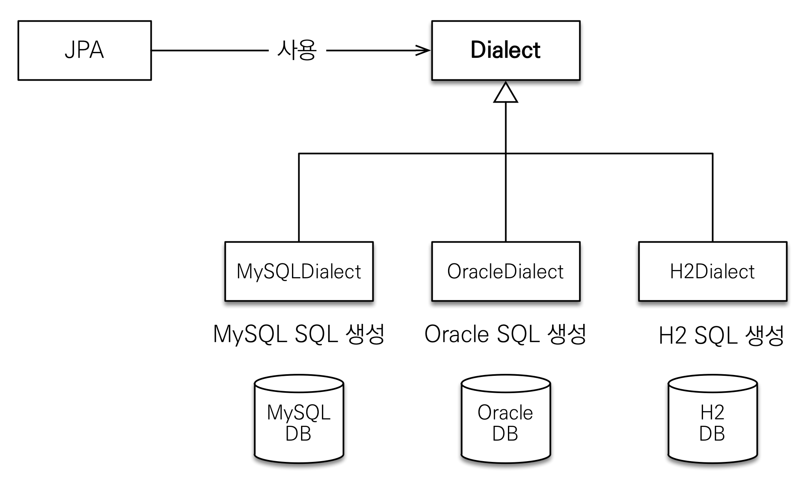

# 자바 ORM 표준 JPA 프로그래밍


## JPA 강좌 소개

- JPA는 SQL을 작성할 필요가 없음
- JPA를 듀토리얼로 배우고 실무에 바로 적용하는 것은 위험
- 목표
  - 객체와 테이블 설계 매칭
  - JPA 내부 동작 방식 이해
  - JPA가 어떤 SQL을 만들어 내는지
  - JPA가 언제 SQL을 생성하는지
- 학습 방법
  - 표준 스펙은 500페이지로 방대
  - 강의는 이론 + 라이브 코딩
  - 6단계 실전 예제
  - 강의를 메인, 책은 참고서
  - 총16시간 : 하루 1시간 반, 2주 완성
- 실무 경험담
  - 실전에서 많은 설계하고 개발
  - 개발이 즐거워짐


## JPA 소개

### SQL 중심적인 개발의 문제점


#### 관계형DB

지금 시대는 객체를 관계형 DB에 저장하고 있다.


##### SQL 중심의 문제점

- 무한반복
- 지루한 코드

SQL에 의존적은 개발을 피하기 어렵다.


##### 패러다임의 불일치

객체를 영구 보관하는 다양한 저장소가 있다.

- Object
  - RDB
  - NOSQL
  - File
  - OODB?


현실적인 대안은 관계형 데이터베이스이다.

객체데이터를 기반으로 SQL로 변환하고 SQL을 만들어 관계형 데이터베이스에 저장한다. 


#### 객체와 관계형 데이터베이스 차이

- 상속
  - RDB
    - DB에서 상속을 사용하면 복잡해져서 사용 안한다
  - 자바 컬렉션
    - 부모 타입으로 조회 후 다형성 활용하여 조회 가능
- 연관관계
  - RDB
    - 외래키를 사용
    - 객체를 테이블에 맞추어 모델링하여 테이블에 맞춘 객체 저장
  - 자바 컬렉션
    - 객체는 참조를 사용
- 데이터 타입
  - RDB
    - 처음 실행하는 SQL에 따라 탐색 범위가 결정하여 엔티티 신뢰 문제 생김
    - 모든 객체를 미리 로딩 할 수 없어 메서드를 여러개 생성해야 한다
    - 계층형 아키텍처 진정한 의미의 **계층 분할**이 어려움
  - 자바 컬렉션
    - 객체는 자유롭게 객체 그래프를 탐색할 수 있어야 한다
- 데이터 식별 방법
  - RDB
    - 호출하여 비교를 하면 다름
  - 자바 컬렉션
    - 호출하여 비교를 하면 같음

객체답게 모델링 할수록 매핑 작업만 늘어난다. 

객체를 자바 컬렉션에 저장 하듯이 DB에 저장할 수는 없을까? **JPA**


### JPA소개

#### ORM

- Object-reational mappring(객체 관계 매핑)
- 객체는 객체대로 설계
- 관계형 데이터베이스는 관계형 데이터베이스대로 설계
- ORM 프레임워크가 중간에서 매핑
- 대중적인 언어에는 대부분 ORM 기술이 존재

JPA는 애플리케이션과 JDBC 사이에서 동작(JDBC API 사용)하여 패러다임 불일치 해결


#### JPA 동작

저장


조회


#### JPA 소개

- EJB - 엔티티 빈(자바표준) -> 하이버네이트(오픈 소스) -> JPA(자바 표준)


#### JPA는 표준 명세

- JPA는 인터페이스의 모음
- JPA 2.1 표준 명세를 구현한 3가지 구현제
- 하이버네이트, EclipseLink, DataNucleus


#### JPA를 왜 사용해야 하는가?

- SQL 중심적인 개발에서 객체 중심으로 개발
- 생산성
  - 코드가 만들어져 있음(CRUD)
- 유지보수
  - 기존에는 필드 변경시 모든 SQL을 수정
  - 필드만 추가하면됨, SQL은 JPA가 처리
- 패러다임의 불일치 해결
  - JPA와 상속
    - 상속관계에서 JPA가 알아서 각 테이블에 저장
  - JPA와 연관관계
    - Java바 Collection처럼 사용하여 데이터를 꺼낼 수 있음
  - 신뢰할 수 있는 엔티티 계층
    - 자유로운 객체 그래프 탐색
  - JPA와 비교
    - 동일한 트랜잭션에서 조회한 엔티티는 같음을 보장
- 성능
  - 1차 캐시와 동일성(identity) 보장
    - 같은 트랜잭션 안에서는 같은 엔티티를 반환 - 약간의 조회 성능 향상
    - DB Isolation Level이 Read Commit이어도 애플리케이션에서 Repeatable Read 보장
  - 트랜잭션을 지원하는 쓰기 지연(transactional write-behind)
    - 트랜잭션을 커밋할 때까지 INSERT SQL을 모음
    - JDBC BATCH SQL 기능을 사용해서 한번에 SQL 전송
  - 지연 로딩(Lazy Loading)
    - 지연 로딩 : 객체가 실제 사용될 떄 로딩
    - 즉시 로딩 : JOIN SQL로 한번에 연관된 객체까지 미리 조회
- 데이터 접근 추상화와 벤더 독립성
- 표준

ORM은 객체와 RDB 두 기둥위에 있는 기술이다.


## Hello JPA - 프로젝트 생성

- H2 Database

  - Web에서 query 작성 가능

  - 가벼움

  - 실습용으로 추천

  - 설정

    - 처음에 JDBC URL : jdbc:h2:~/test
      - 이후에 위 주소로 접속시 파일에 락이 걸려 여러곳에서 접속을 못하는 문제
    - 이후 jdbc:h2:tcp://localhost/~/test 로 접속

  - Version

    - spring boot docs를 참고하여 버전 설정
    - 다운로드한 H2 Database와 같은 버전 설정으로 할 것

  - [접속 URL]: 127.0.0.1:8082
    [DownLoad]: https://www.h2database.com/html/main.html


### 프로젝트

### 설정

라이브러리 추가 - pom.xml

```xml
<?xml version="1.0" encoding="UTF-8"?>
<project xmlns="http://maven.apache.org/POM/4.0.0"
xmlns:xsi="http://www.w3.org/2001/XMLSchema-instance"
xsi:schemaLocation="http://maven.apache.org/POM/4.0.0 http://maven.apache.org/xsd/maven-4.0.0.xsd">
    
    <modelVersion>4.0.0</modelVersion>
    <groupId>jpa-basic</groupId>
    <artifactId>ex1-hello-jpa</artifactId>
    <version>1.0.0</version>
    
    <dependencies>
        <!-- JPA 하이버네이트 -->
        <dependency>
            <groupId>org.hibernate</groupId>
            <artifactId>hibernate-entitymanager</artifactId>
            <version>5.3.10.Final</version>
        </dependency>
        <!-- H2 데이터베이스 -->
        <dependency>
            <groupId>com.h2database</groupId>
            <artifactId>h2</artifactId>
            <version>1.4.199</version>
        </dependency>
    </dependencies>
    
</project>
```

JPA 설정 - persistence.xml

- JPA 설정 파일
- resources/META-INF/persistence.xml 에 위치
- persistence-unit name으로 이름 지정
- javax.persistence로 시작: JPA 표준 속성
- hibernate로 시작: 하이버네이트 전용 속성

```xml
<?xml version="1.0" encoding="UTF-8"?>
<persistence version="2.2"
xmlns="http://xmlns.jcp.org/xml/ns/persistence" xmlns:xsi="http://www.w3.org/2001/XMLSchema-instance"
xsi:schemaLocation="http://xmlns.jcp.org/xml/ns/persistence http://xmlns.jcp.org/xml/ns/persistence/persistence_2_2.xsd">
    
    <persistence-unit name="hello">
        <properties>
            <!-- 필수 속성 -->
            <property name="javax.persistence.jdbc.driver" value="org.h2.Driver"/>
            <property name="javax.persistence.jdbc.user" value="sa"/>
            <property name="javax.persistence.jdbc.password" value=""/>
            <property name="javax.persistence.jdbc.url" value="jdbc:h2:tcp://localhost/~/test"/>
            <property name="hibernate.dialect" value="org.hibernate.dialect.H2Dialect"/>
            <!-- 옵션 -->
            <property name="hibernate.show_sql" value="true"/>
            <property name="hibernate.format_sql" value="true"/>
            <property name="hibernate.use_sql_comments" value="true"/>
            <!--<property name="hibernate.hbm2ddl.auto" value="create" />-->
        </properties>
    </persistence-unit>
    
</persistence>
```


#### 데이터베이스 방언



- JPA는 특정 데이터베이스에 종속 되지 않음
- 각각 데이터베이스 마다 SQL 문법과 함수가 조금씩 다름
- hibernate.dialect 속성에 지정
  - H2 : org.hibernate.dialect.H2Dialect
  - Oracle 10g : org.hibernate.dialect.Oracle10gDialect
  - MySQL : org.hibernate.dialect.MySQL5InnoDBDialect
- 하이버네이트는 40가지 이상의 데이터베이스 방언 지원
- 방언 뜻 : SQL 표준을 지키지 않는 특정 데이터베이스만의 고유한 기능


## Link

- https://www.inflearn.com/course/ORM-JPA-Basic