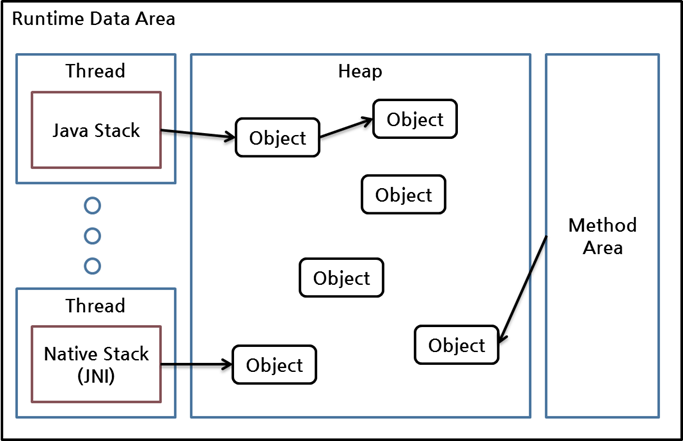
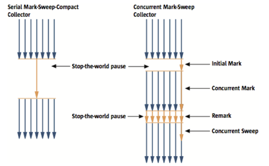

# JVM GC

## GC(Garbage collection)

Java GC는 GC 대상 객체를 찾고, 대상 객체를 처리(finalization)하고, 할당된 메모리를 회수하는 작업으로 구성된다.

GC는 크게 아래의 2가지 동작을 한다.

- 힙(heap) 내의 객체 중에서 가비지(garbage)를 찾아낸다.
- 찾아낸 가비지를 처리해서 힙의 메모리를 회수한다.

객체가 가비지인지 판별하기 위해서 reachability라는 개념을 사용한다. 어떤 객체에 유효한 참조가 있으면 **reachable**로, 없으면 **unreachable**로 구별하고, unreachable 객체를 가비지로 간주해 GC를 수행한다. 한 객체는 여러 다른 객체를 참조하고, 참조된 다른 객체들도 마찬가지로 또 다른 객체들을 참조할 수 있으므로 객체들은 참조 사슬을 이룬다. 이런 상황에서 유효한 참조 여부를 파악하려면 항상 유효한 최초의 참조가 있어야 하는데 이를 객체 참조의 root set이라고 한다.

아래는 JVM에서 메모리 영역인 런타임 데이터 영역(runtime data area)의 구조의 그림이다.

런타임 데이터 영역은 위와 같이 스레드가 차지하는 영역들과, 객체를 생성 및 보관하는 하나의 큰 힙, 클래스 정보가 차지하는 영역인 메서드 영역, 크게 세 부분으로 나눌 수 있다. 위 그림에서 객체에 대한 참조는 화살표로 표시되어 있다.

힙에 있는 객체들에 대한 참조는 다음 4가지 종류 중 하나이다.

- 힙 내의 다른 객체에 의한 참조
- Java 스택, 즉 Java 메서드 실행 시에 사용하는 지역 변수와 파라미터들에 의한 참조
- 네이티브 스택, 즉 JNI(Java Native Interface)에 의해 생성된 객체에 대한 참조
- 메서드 영역의 정적 변수에 의한 참조

이들 중 힙 내의 다른 객체에 의한 참조를 제외한 나머지 3개가 root set으로, reachability를 판가름하는 기준이 된다.

reachability를 더 자세히 설명하기 위해 root set과 힙 내의 객체를 중심으로 다시 그리면 다음과 같다.

root set으로부터 시작한 참조 사슬에 속한 객체들은 reachable 객체이고, 이 참조 사슬과 무관한 객체들이 unreachable 객체로 GC 대상이다. 오른쪽 아래 객체처럼 reachable 객체를 참조하더라도, 다른 reachable 객체가 이 객체를 참조하지 않는다면 이 객체는 unreachable 객체이다.

이 그림에서 참조는 모두 java.lang.ref 패키지를 사용하지 않은 일반적인 참조이며, 이를 흔히 strong reference라 부른다.

## 과정

GC에 알아보기 전에 **stop-the-world**를 알아야 한다. CG를 실행하기 위해 JVM이 애플리케이션 실행을 멈춘다. CG를 실행하는 쓰레드를 제외한 나머지 쓰레드가 모두 작업을 멈추고 작업을 완료한 이후 중단해던 작업을 다시 시작한다. CG튜닝은 보통 **stop-the-worl**를 줄이는 것이다.

Java에서 명시적으로 메모리를 지정하여 해제하는 방법으로 System.gc() 메서드를 호출하는 시스템 성능에 많은 영향을 끼치므로 사용하지 않아야 한다.

GC는 아래 2가지의 전제로 만들어졌다.

- 대부분의 객체는 금방 접근 불가능 상태(unreachable)가 된다.
- 오래된 객체에서 젊은 객체로의 참조는 아주 적게 존재한다.

전제의 장점을 최대한 살리기 위해 HotSpot VM에서는 크게 물리적 공간을 2개로 나누었다. **Young **과 **Old** 영역이다.

- Young 영역(Yong Generation 영역) : 새롭게 생성한 객체의 대부분은 여기에 위치한다. 금방 접근 금방 불가능 상태가 되기 때문에 많은 객체가 Young 영역에 생성되었다가 사라진다. 객체가 사라질때 Minor GC가 발생한다고 한다.
- Old 영역(Old Generation 영역) : 접근 불가능 상태로 되지 않아 Young 영역에서 살아남은 객체가 복사된다. 대부분 Young 영역보다 크게 할당하며, Young 영역보다 GC는 적게 발생한다. 객체가 사라질 때 Major GC(혹은 Full GC)가 발생한다고 말한다.

아래의 그림은 영역별 데이터 흐름이다.

Permanent Generation 영역(이하 Perm 영역)은 Method Area라고도 한다. 객체나 억류된 문자열 정보를 저장하는 독립적인 곳이다. 이 영역에서의 GC가 발생하며 Major GC의 횟수에 포함된다.

Old 영역에 있는 객체가 Young 영역의 객체를 참조하는 경우가 있을 때에는 어떻게 처리될까?

이러한 경우를 위해 Old 영역에는 512바이트의 덩어리(chunk)로 되어 있는 카드 테이블(card table)이 존재한다.

카드 테이블에는 Old 영역에 있는 객체가 Young 영역의 객체를 참조할 때마다 정보가 표시된다. Young 영역의 GC를 실행할 때 카드 테이블만 뒤져서 GC 대상인지 식별한다.

카드 테이블은 write barrier를 사용하여 관리한다. Minor GC를 빠르게 할 수 있도록 하는 장치이다. 약간의 오버헤드는 발생하지만 전박적인 GC 시간은 줄어들게 된다.

## Young 영역 GC

객체가 제일 먼저 생성되는 Young 영역부터 알아보자. Young 영역은 3개의 영역으로 나뉜다.

- Eden 영역
- Survivor 영역(2개)

각 영역의 처리 순서는 다음과 같다.

- 새로 생성한 대부분의 객체는 Eden 영역에 위치한다.
- Eden 영역에서 GC가 한 번 발생한 후 살아남은 객체는 Survivor 영역 중 하나로 이동된다.
- Eden 영역에서 GC가 발생하면 이미 살아남은 객체가 존재하는 Survivor 영역으로 객체가 계속 쌓인다.
- 하나의 Survivor 영역이 가득 차게 되면 그 중에서 살아남은 객체를 다른 Survivor 영역으로 이동한다. 그리고 가득 찬 Survivor 영역은 아무 데이터도 없는 상태로 된다.
- 이 과정을 반복하다가 계속해서 살아남아 있는 객체는 Old 영역으로 이동하게 된다.

Survivor 영역 중 하나는 **반드시 비어 있는 상태**로 남아 있어야 한다. 만약 두 Survivor 영역에 모두 데이터가 존재하거나, 두 영역 모두 사용량이 0이라면 시스템은 정상적인 상황이 아니라고 생각하면 된다.

Minor GC를 통해서 Old 영역까지 데이터가 쌓인 것을 간단히 나타내면 다음과 같다.

HotSpot VM에서는 보다 빠른 메모리 할당을 위해서 두 가지 기술을 사용한다. 하나는 bump-the-pointer라는 기술이며, 다른 하나는 TLABs(Thread-Local Allocation Buffers)라는 기술이다.

bump-the-pointer는 Eden 영역에 할당된 마지막 객체를 추적한다. 마지막 객체는 Eden 영역의 맨 위에 있다. 그 다음에 생성되는 객체가 있으면, 해당 객체의 크기가 Eden 영역에 넣기 적당한지만 확인한다. 해당 객체의 크기가 적당하다고 판단되면 Eden 영역에 넣고, 새로 생성된 객체가 맨 위에 있게 된다. 새로운 객체를 생성할 때 마지막에 추가된 객체만 점검하면 되므로 매우 빠르게 메모리 할당이 이루어진다.

그러나 멀티 스레드 환경을 고려하면 이야기가 달라진다. Thread-Safe하기 위해서 다중 스레드에서 객체를 Eden 영역에 저장하려면 락이 발생할 수 밖에 없고, lock-contention 때문에 성능은 매우 떨어지게 될 것이다. HotSpot VMdㅔ서 이를 해결한 것이 TLABs이다.

각각의 스레드가 각각의 몫에 해당하는 Eden 영역의 작은 덩어이를 가질 수 있도록 하는 것이다. 각 쓰레드에는 자기가 갖고 있는  TLAB에만 접근할 수 있기 떄문에, bump-the-pointer라는 기술을 사용하더라도 아무런 락이 없이 메모리 할당이 가능하다.

Eden 영역에 최초로 객체가 만들어지고, Survivor 영역을 통해서 Old 영역으로 오래 살아남은 객체가 이동한다는 사실은 중요한 내용이니 꼭 기억하자.

## Old 영역 GC

Old 영역은 기본적으로 데이터가 가득 차면 GC를 실행한다. GC 방식에 따라서 처리 절차가 달라진다. JDK 7을 기준으로 5가지 방식이 있다.

- Serial GC
- Parallel GC
- Parallel Old GC(Parallel Compacting GC)
- Concurrent Mark & Sweep GC(이하 CMS)
- G1(Garbage First) GC

운영 서버에서 절대 사용하면 안 되는 방식이 **Serial GC**다. Serial GC는 데스크톱의 CPU 코어가 하나만 있을 때 사용하기 위해서 만든 방식이다. Serial GC를 사용하면 애플리케이션의 성능이 많이 떨어진다.

각 GC 방식에 대해서 알아보자.

### Serial GC (-XX:+UseSerialGC)

Old 영역의 GC는 mark-sweep-compact이라는 알고리즘을 사용한다. 이 알고리즘의 첫 단계는 Old 영역에 살아 있는 객체를 식별하는 것이다. 그 다음에는 힙(heap)의 앞 부분부터 확인하여 살아 있는 것만 남긴다(Sweep). 마지막 단계에서는 각 객체들이 연속되게 쌓이도록 힙의 가장 앞 부분부터 채워서 객체가 존재하는 부분과 객체가 없는 부분으로 나눈다(Compaction).

Serial GC는 적은 메모리와 CPU 코어 개수가 적을 때 적합한 방식이다.

### Parallel GC (-XX:+UseParallelGC)

Parallel GC는 Serial GC와 기본적인 알고리즘은 같다. 그러나 Serial GC는 GC를 처리하는 스레드가 하나인 것에 비해, Parallel GC는 GC를 처리하는 쓰레드가 여러 개이다. 그렇기 때문에 Serial GC보다 빠른게 객체를 처리할 수 있다. Parallel GC는 메모리가 충분하고 코어의 개수가 많을 때 유리하다. Parallel GC는 Throughput GC라고도 부른다.

Serial GC와 Parallel GC의 스레드를 비교한 그림이다.

### Parallel Old GC(-XX:+UseParallelOldGC)

Parallel Old GC는 JDK 5 update 6부터 제공한 GC 방식이다. Parallel GC와 비교하여 Old 영역의 GC 알고리즘만 다르다. 이 방식은 Mark-Summary-Compaction 단계를 거친다. Summary 단계는 앞서 GC를 수행한 영역에 대해서 별도로 살아 있는 객체를 식별한다는 점에서 Mark-Sweep-Compaction 알고리즘의 Sweep 단계와 다르며, 약간 더 복잡한 단계를 거친다.

### CMS GC (-XX:+UseConcMarkSweepGC)

Serial GC와 CMS GC의 절차를 비교한 그림이다. 그림에서 보듯이 CMS GC는 지금까지 설명한 GC 방식보다 더 복잡하다.

초기 Initial Mark 단계에서는 클래스 로더에서 가장 가까운 객체 중 살아 있는 객체만 찾는 것으로 끝낸다. 멈추는 시간은 매우 짧다. 그리고 Concurrent Mark 단계에서는 방금 살아있다고 확인한 객체에서 참조하고 있는 객체들을 따라가면서 확인한다. 이 단계의 특징은 다른 스레드가 실행 중인 상태에서 동시에 진행된다는 것이다.

그 다음 Remark 단계에서는 Concurrent Mark 단계에서 새로 추가되거나 참조가 끊긴 객체를 확인한다. 마지막으로 Concurrent Sweep 단계에서는 쓰레기를 정리하는 작업을 실행한다. 이 작업도 다른 스레드가 실행되고 있는 상황에서 진행한다.

이러한 단계로 진행되는 GC 방식이기 때문에 stop-the-world 시간이 매우 짧다. 모든 애플리케이션의 응답 속도가 매우 중요할 때 CMS GC를 사용하며, Low Latency GC라고도 부른다.

그런데 CMS GC는 stop-the-world 시간이 짧다는 장점에 반해 다음과 같은 단점이 존재한다.

- 다른 GC 방식보다 메모리와 CPU를 더 많이 사용한다.
- Compaction 단계가 기본적으로 제공되지 않는다.

CMS GC를 사용할 때에는 신중히 검토한 후에 사용해야 한다. 그리고 조각난 메모리가 많아 Compaction 작업을 실행하면 다른 GC 방식의 stop-the-world 시간보다 stop-the-world 시간이 더 길기 때문에 Compaction 작업이 얼마나 자주, 오랫동안 수행되는지 확인해야 한다.

## G1 GC

G1(Garbage First) GC를 이해하려면 지금까지의 Young 영역과 Old 영역에 대해서는 잊는 것이 좋다.

아래의 그림을 보면 G1 GC는 바둑판의 각 영역에 객체를 할당하고 GC를 실행한다. 그러다가, 해당 영역이 꽉 차면 다른 영역에서 객체를 할당하고 GC를 실행한다. 즉, 지금까지 설명한 Young의 세가지 영역에서 데이터가 Old 영역으로 이동하는 단계가 사라진 GC 방식이라고 이해하면 된다. G1 GC는 장기적으로 말도 많고 탈도 많은 CMS GC를 대체하기 위해서 만들어 졌다.

G1 GC의 가장 큰 장점은 성능이다. 지금까지 설명한 어떤 GC 방식보다도 빠르다. 하지만, JDK 6에서는 G1 GC를 early access라고 부르며 그냥 시험삼아 사용할 수만 있도록 한다. 그리고 JDK 7에서 정식으로 G1 GC를 포함하여 제공한다.

## 참고

- https://d2.naver.com/helloworld/1329
- https://d2.naver.com/helloworld/329631