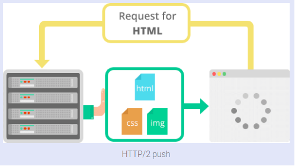

# HTTP/1 VS HTTP/2 차이점

## HTTP란 무엇인가?

**HTTP**(Hypertext Transfer Protocol)는 월드 와이드 웹 (World Wide Web)의 데이터 통신의 기초가 되는 응용 프로그램 프로토콜입니다.

**HTTP**는 클라이언트 / 서버 모델을 기반으로합니다. 클라이언트 / 서버 모델은 요청 및 응답을 통해 통신하는 두 대의 컴퓨터, 즉 클라이언트 (서비스 수신자) 및 서버 (서비스 공급자)로 설명 될 수 있습니다.

간단하고 추상적인 예는 레스토랑 손님과 웨이터가 될 것입니다. 게스트(클라이언트)가 웨이터에게(서버)에게 식사를 요청하면 (웨이터 (응용 프로그램 논리)) 식사를 게스트에게 가져옵니다.

이는 매우 단순한 예이지만 개념을 이해하는 데 도움이되는 정보이기도합니다.

## HTTP/2 란 무엇인가?

2015년에 IETF (Internet Engineering Task Force)는 가장 유용한 인터넷 프로토콜 인 HTTP의 두 번째 주요 버전 인 HTTP/2를 출시합니다. 그것은 이전의 실험 SPDY 프로토콜에서 파생되었습니다.

## HTTP/2 개발의 주요 목표

- 프로토콜 협상 메커니즘 - 프로토콜 선택, 예. HTTP / 1.1, HTTP / 2 또는 기타.
- HTTP / 1.1과의 높은 수준의 호환성 - 메소드, 상태 코드, URI 및 헤더 필드
- 페이지 로딩 속도 향상
- 요청 헤더 압축
- 이진 프로토콜
- HTTP/2 서버 푸시
- 단일 TCP 연결을 통해 요구 다중화
- 파이프 라인을 요구하는
- HOL 차단 (Head-of-Line) - 패키지 차단

## 멀티플렉싱 요청

HTTP/2는 단일 TCP 연결을 통해 여러 데이터 요청을 병렬로 보낼 수 있습니다. 이것은 한 서버에서 비동기 적으로 웹 파일을 다운로드 할 수 있기 때문에 HTTP/2 프로토콜의 가장 진보 된 기능입니다. 대부분의 최신 브라우저는 하나의 서버에 대한 TCP 연결을 제한합니다.

이렇게하면 추가 왕복 시간 (RTT)이 줄어들어 최적화없이 웹 사이트를 더 빠르게로드 할 수 있으며 도메인 샤딩이 필요하지 않습니다.

## 헤더 압축

HTTP/2는 많은 수의 여분의 헤더 프레임을 압축합니다. HPACK 사양을 헤더 압축에 대한 간단하고 안전한 방법으로 사용합니다. 클라이언트와 서버는 이전 클라이언트 - 서버 요청에 사용 된 헤더 목록을 유지 관리합니다.

HPACK은 서버로 전송되기 전에 각 헤더의 개별 값을 압축 한 다음 이전에 전송 된 헤더 값 목록에서 인코딩 된 정보를 조회하여 전체 헤더 정보를 재구성합니다.

## 이진 프로토콜

최신 HTTP 버전은 텍스트 프로토콜에서 바이너리 프로토콜로 변환하는 것과 같은 기능 및 특성 측면에서 크게 발전했습니다. 요청 - 응답주기를 완료하기 위해 텍스트 명령을 처리하는 데 사용되는 HTTP1.x입니다. HTTP/2는 동일한 태스크를 실행하기 위해 1 및 0의 2 진 명령을 사용합니다. 이 속성은 프레이밍과 관련된 복잡성을 줄이고 텍스트와 선택적 공백이 포함 된 명령으로 인해 혼동스럽게 혼합 된 명령의 구현을 단순화합니다.

HTTP/2 구현을 사용하는 브라우저는 동일한 텍스트 명령을 네트워크를 통해 전송하기 전에 바이너리로 변환합니다.

장점:

- 데이터 분석시 오버 헤드가 적습니다. 이는 HTTP/2와 HTTP1의 중요한 가치 제안입니다.
- 오류가 발생하지 않습니다.
- 네트워크의 공간 절약화.
- 효과적인 네트워크 리소스 활용.
- 응답 분할 공격과 같은 HTTP1.x의 텍스트 특성과 관련된 보안 문제를 제거합니다.
- 압축, 다중화, 우선 순위 지정, 흐름 제어 및 TLS의 효과적인 처리를 포함하여 HTTP/2의 다른 기능을 사용 가능하게합니다.
- 보다 쉬운 처리 및 구현을위한 컴팩트 한 명령 표현.
- 클라이언트와 서버 간의 데이터 처리면에서 효율적이고 견고합니다.
- 네트워크 대기 시간 감소 및 처리량 향상.

## HTTP/2 서버 푸시

이 기능을 사용하면 서버는 요구되지 않지만 미래의 요구에 예상되는 추가 캐시 가능한 정보를 클라이언트에 보낼 수 있습니다. 예를 들어, 클라이언트가 자원 X를 요청하고 자원 Y가 요청한 파일에서 참조되는 것이 이해되는 경우 서버는 적절한 클라이언트 요청을 기다리는 대신 X에서 Y를 밀어 선택할 수 있습니다 .

장점 :

- 클라이언트는 푸시 된 리소스를 캐시에 저장합니다.
- 클라이언트는 이러한 캐시 된 리소스를 다른 페이지에 걸쳐 재사용 할 수 있습니다.
- 서버는 같은 TCP 연결에서 처음으로 요청한 정보와 함께 푸시 된 자원을 다중화 할 수 있습니다.
- 서버는 푸시 된 자원에 우선 순위를 지정할 수 있습니다 - HTTP / 2 HTTP1의 주요 성능의 차별화 요인입니다.
- 클라이언트는 캐시 된 자원의 효과적인 저장소를 유지하기 위해 추진 된 자원을 거부하거나 서버 푸시를 완전히 비활성화 할 수 있습니다.
- 클라이언트는 동시에 다중화되는 푸시 스트림의 수를 제한 할 수 있습니다.

당신이 레스토랑이나 웨이터 손님에 대한 이야기를 기억한다면, 그것은 예입니다

HTTP/1.1 및 HTTP/2 프로토콜이 약간의 차이가 있습니다. 웨이터는 TCP 연결이며, 당신은 당신의 식사와 물 한 병을 주문하고 싶다고 상상해보십시오. HTTP/1.1의 경우, 어느 웨이터에게 식사와 다른 웨이터에 물을 구해 주세요.따라서, 2개의 TCP connection를 할당합니다. HTTP/2의 경우, 웨이터는 1명만 양쪽 모두를 부탁합니다만, 웨이터는 따로 따로 가져와 줍니다. TCP 연결을 하나만 지정하면 서버의 부하가 경감되고 서버는 다음 클라이언트 (손님) 용의 여유 연결 (웨이터)이 추가됩니다.

HTTP/1.1과 HTTP/2의 실제 차이점은 서버 푸시 예제와 함께 제공됩니다.

게스트 (클라이언트)가 웨이터 (서버)에 식사를 요구 (요청을 제출)하면 웨이터는 레스토랑의 요리사 (응용 프로그램 로직)에서 식사를 가져옵니다 만, 웨이터도 생수가 필요하다고 생각합니다. 당신의 식사라도 그것을 초래합니다. 따라서 TCP 연결이 하나만 있으며 요청이 하나가되어, 서버의 부하가 크게 줄어 듭니다.

이러한 메커니즘의 간단한 쇼케이스로 간단한 예제 페이지를 만들었습니다.

여기에있는 것은 HTTP/1.1 HTTP/2 및 HTTP/2 서버 푸시를 설명하는 데 사용하는 100개의 검사 이미지가 포함 된 간단한 페이지입니다.

위의 그림에서주의해야 할 것은, 요청 수,로드 시간 프로토콜 열 초기화 프로그램 열 및 폭포 그림 자체입니다 (유감스럽지만, 그 이외의 데이터를 보는 것은 곤란합니다). TTFB 및 컨텐츠 다운로드 시간 (예를 들어, 자원 스케줄링 및 및 연결 시작 시간).

### For HTTP/1.1:

요청 수 : 102

로드 시간 : 12.97 초

프로토콜 : "http / 1.1"

초기 열 : 첫 번째 초기자는 사용자/클라이언트에서 나머지 요청은 다른 자원 (이 경우 이미지)가 필요하다는 것을 인식 한 클라이언트에 대한 응답에 의해 시작됩니다.

폭포 그림 : 여러 배치를 통해 요청이 어떻게 이루어지고 있는지 (TCP 연결)을 확인할 수 있습니다.

### For HTTP/2:

요청 수 : 102

로드 시간 : 11.19s

프로토콜 : "h2"(HTTP/2)

초기 열 : 첫 번째 초기자는 사용자 / 클라이언트이며, 나머지 요청은 다른 자원 (이 경우 이미지)가 필요하다는 것을 인식 한 클라이언트에 대한 응답에 의해 시작됩니다.

폭포 그림 : 두 개의 일괄 처리 (TCP 연결)를 통해 요청이 어떻게 이루어지고 있는지를 볼 수 있습니다.

로드 시간에주의하십시오. 이 경우, 그것은 HTTP / 1.1 예 로딩 시간보다 조금 낮지 만, 반드시 그런 필요는 없습니다. 이 예는 클라이언트 요청의 다중화를 보여줍니다.

### HTTP/2 server push:

요청 수 : 102

로드 시간 : 3.17 초

프로토콜 : "h2"(HTTP/2)

초기 열 : 첫 번째 초기자는 사용자 / 클라이언트에서 나머지 요구는 서버 푸시에 의해 시작됩니다 (실질적으로 하나의 요청 / 응답 사이클).

폭포 그림 : 1 배치 (1 TCP 연결)에서 요청이 어떻게 행해지는지를 볼 수 있습니다.

## 브라우저 호환성

최근의 대부분의 브라우저는 Opera mini (모든 버전) 및 UC Browser for Android를 제외하고 HTTP/2 프로토콜을 완벽하게 지원하고 있습니다. IE11과 같이 부분적으로 지원되는 것 (연두색)도 있습니다.

당신은이 링크 https://caniuse.com/#feat=http2 브라우저 지원 자세한 내용을 확인할 수 있습니다

## HTTP/2를 사용하여 사이트의 속도

HTTP / 2는 HTTP / 1.1의 문제를 완화하는 많은 새로운 구조와 당신의 Web 페이지의 성능을 향상시키는 것을 제공합니다. 현재 Web 클라이언트에 의해 광범위하게 지원되기 때문에, 그 구현은 간단합니다. HTTP / 2 프로토콜의 구현은 간단하지만, 그것을 사용하면이 프로토콜의 가능성을 최대한 활용하기 위해 (클라이언트에 자산의 제공 등) 메커니즘을 변경할 필요가 있다는 점에 유의할 필요가 있습니다.

## 참고

- https://medium.com/@factoryhr/http-2-the-difference-between-http-1-1-benefits-and-how-to-use-it-38094fa0e95b