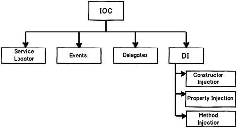

# Spring IOC/DI


## IOC

**Inverse of Control**는 제어의 역전이라는 뜻으로 제 3자에게 제어권을 가지게 하는 것이다. 

**왜 제3자에게 제어권을 넘겨야 하는지 알아보자**


우리는 서로 다른 객체를 느슨하게 결합하는 방법으로 IOC를 사용하고 있다.


## DI

**Dependency Injection**는 의존관계라 분리된 상태에서 의존성을 주입 한다는 뜻으로 외부에서 객체를 생성할때 의존성을 주입하는 것이다.

Ioc방식 에서 대표적으로 많이 사용하는 방식으로 interface를 활용하여 Runtime시점에 Dependency를 가진다.


## IOC/DI

간단한 예제를 통해 Ioc와 DI에 대해 자세히 알아보자.

```java
public class UserService {
    private final ObjectMapper objectMapper = new ObjectMapper();

    public String parseString(User user) throws JsonProcessingException {
        return this.objectMapper.writeValueAsString(user);
    }

}
```

위의 코드는 Jakson라이브러리를 사용하여 String을 반환하는 코드이다. 

Gson라이브러리를 사용하려고 라이브러리를 변경하면 어떻게 될까?

```java
public class UserService {
    private final Gson gson = new Gson();

    public String parseString(User user) throws JsonProcessingException {
        return this.gson.toJson(user);
    }

}
```

코드를 보면 라이브러리를 변경하면서 내부에 사용하는 코드도 같이 변경되었다. 혼자 사용하는 코드가 아닌 다른사람들과 같이 사용하는 코드라면 라이브러리가 변경될때마다 사용중인 코드를 모두 변경하여야 하는 상황이 온다.

의존성에 대한 개념으로 **Coupling**이 있다. 모듈간의 결합도와 상호의존성의 정도를 뜻한다.


위의 Util은 왼쪽 그림처럼 강하게 결합되어 있어 다른 라이브러리로 변경하게 되면 많은 코드 수정이 필요하다. 오른쪽 그림처럼 수정 하려면 **Interface**를 활용하여야 한다.

```java
public interface UtilParser {
    <T> String parseString(T data);
}

public class JacksonParser implements UtilParser {
    private final ObjectMapper objectMapper;

    public JacksonParser() {
        this.objectMapper = new ObjectMapper();
    }
  
    @Override
    public <T> String parseString(T data) {
        try {
            return this.objectMapper.writeValueAsString(data);
        } catch (JsonProcessingException e) {
            throw new JsonParseException(e);
        }
    }
}

public class GsonParser implements UtilParser {
    private final Gson gson;

    public GsonParser() {
        this.gson = new Gson();
    }
  
  	@Override
    public <T> String parseString(T data) {
        return this.gson.toJson(data);
    }
}
```

```java
public class ParserUtil {

    public String parseString(UtilParser parser, User user) {
        return parser.parseString(user);
    }
}
```

`ObjectMapper`로 구현되어 있던 부분이 `UtilParser`로 변경되었다. Inteface를 활용하여 Jackson라이브러리가 아닌 Gson라이브러리로 변경 하였다. 위의 코드는 사용하고자 하는 **Parser**를 설정하지 않았기 떄문에 `NullPointerException`이 발생한다. 

그러면 사용하고자 하는 Parser를 설정해보자

```java
public class ParserUtil {
    private final UtilParser utilParser;

    public ParserUtil() {
        this.utilParser = new GsonParser();
    }

    public String parse(UtilParser parser, User user) {
        return parser.parseString(user);
    }
}
```

이상한 점을 찾아보자. Parser를 유동적으로 사용하기 위해 Interface를 활용하였지만 또 다시 강한 의존적인 관계를 맺는 상태가 되었다. 

**의존관계를 약하게 결합하려면 어떻게 해야 할까?**

**제어 권을 제 3자에게 넘겨서(IOC)** 의존성이 분리된 객체를 **외부에서 주입(DI)** 받아서 사용해야 한다.

의존성을 주입 받는 방법으로는 아래와 같은 방법이 있다.



주로 사용하는 DI 방법에 대해서 알아보자.

### Constructor Injection

생성자를 통해 주입하는 방법으로 주로 필수적인 Dependency에 사용한다.

```java
public class ParserUtil {
  
    private final Parser parser;

    public ParserUtil(Parser parser) {
        this.parser = parser;
    }
  
}

//use
public class UserService {

    public String parseString(User user) throws JsonProcessingException {
        ParserUtil parserUtil = new ParserUtil(new GsonParser());
        return this.parserUtil.parseString(user);
    }

}
```

### Setter Injection

부수적으로 필요한  Dependency에 사용한다.

```java
public class ParserUtil {
  
    private final Parser parser;

    public setParser(Parser parser) {
        this.parser = parser;
    }
  
}

//use
public class UserService {

    public String parseString(User user) throws JsonProcessingException {
        ParserUtil parserUtil = new ParserUtil();
        parserUtil.setParser(new GsonParser());
        return this.parserUtil.parseString(user);
    }

}
```


위의 방법을 사용하면 테스트를 보다 쉽게 할 수 있다. 내가 원하는 Parser를 주입하여 손쉽게 변경하여 테스트 할 수 있기 때문이다.


## 참고

- https://alwayspr.tistory.com/