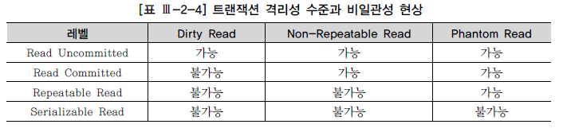

## Spring Transaction

트랜잭션은 데이터베이스의 컨텍스트에서 데이터 검색 또는 업데이트를 위해 독립적으로 실행되는 논리 단위입니다. 관계형 데이터베이스에서 데이터베이스 트랜잭션은 원자성, 일관성, 독립성, 지속성이 있어야하며 ACID 약어로 요약됩니다.

- 원자성(Atomicity) : 트랜잭션은 완전히 완료, 저장 (커밋) 또는 완전히 실행 취소 (롤백)되어야합니다. 소매점 데이터베이스의 판매는 원가를 설명하는 시나리오를 설명합니다. 예를 들어 판매가 재고 감소와 현금 유입 기록으로 구성됩니다. 둘 다 함께 일어나거나 일어나지 않습니다.
- 일관성(Consistency) : 트랜잭션은 트랜잭션 이전의 상태와 완전히 일치해야합니다. 즉, 트랜잭션은 데이터베이스의 제약 조건을 깨뜨릴 수 없습니다. 예를 들어 데이터베이스 테이블의 전화 번호 열에 숫자 만 포함 할 수있는 경우 일관성은 알파벳 문자를 입력하려고하는 모든 트랜잭션이 커밋되지 않도록 지시합니다.
- 격리성(Isolation) : 원래 트랜잭션이 커밋 또는 롤백될 때까지 트랜잭션 데이터를 다른 트랜잭션에서 사용할 수 없습니다.
- 지속성(Durablility) : 트랜잭션이 성공적으로 완료된 경우, 결과는 영구적으로 반영되어야 한다.

## Commit & Rollback

### Commit

한개의 논리적 단위(트랜잭션)이 성공적으로 처리되고 데이터베이스가 다시 일관된 상태가 되었을때 갱신 연산이 완료된 것을 트랜잭션 관리자에게 알려준다.

### Rollback

하나의 트랜잭션 처리가 비정상적으로 종료되어서 데이터베이스의 일관성을 깨뜨렸을 때, 트랜잭션의 일부분이 정상적으로 실행되었어도 트랜잭션의 원자성을 구현하기 위해 트랜잭션의 모든 연산을 취소한다.

## @Transactional

스프링에서 트랜잭션을 처리할때 어노테이션 방식으로 `@Transactional`을 사용하는 경우를 선언적 트랜잭션이라고 부른다.

`@Transactional`을 사용하면 해당 클래스에 트랜잭션이 기능이 적용된 프록시 객체가 생성되며 어노테이션이 적용된 부분이 호출될 경우 **PlatformTransactionManager**를 사용하여 트랜잭션을 시작하고, 성공 실패 여부에 따라 Commit 또는 Rollback 한다.

## 트랜잭션에서의 문제 

다수의 트랜잭션에서 발생할 수 있는 문제에 대해 알아보자.

예를들어 특정 트랜잭션이 처리중이고 아직 커밋되지 않았는데 다른 트랜잭션이 접근한 경우 다음과 같은 문제가 발생할 수 있다.

### Dirty Read

다른 트랜잭션에 의해 수정됐지만 아직 커밋되지 않은 데이터를 읽는 것을 말한다. 변경 후 아직 커밋되지 않은 값을 읽었는데 변경을 가한 트랜잭션이 최종적으로 롤백된다면 그 값을 읽은 트랜잭션은 비일관된 상태에 놓이게 된다.

A라는 트랜잭션이 1에서 2로 값을 변경하고 아직 커밋하지 않았을때 B라는 트랜잭션이 값을 읽는 경우 2가 조회 된다. 

### Non-Repeatable Read

한 트랜잭션 내에서 같은 쿼리를 두 번 수행했는데, 그 사이에 다른 트랜잭션이 값을 수정 또는 삭제하는 바람에 두 쿼리 결과가 다르게 나타나는 현상을 말한다.

A트랜잭션이 값을 조회하여 데이터 1이라는 값을 얻었다. 이후에 같은 쿼리를 실행하여 데이터를 얻으려 하는 도중에 B라는 트랜잭션이 값을 2로 바꾸고 커밋해버리면 A트랜잭션은 2라는 결과를 얻게 된다.

### Phantom Read

한 트랜잭션 내에서 같은 쿼리를 두 번 수행했는데, 첫 번째 쿼리에서 없던 유령(Phantom) 레코드가 두 번째 쿼리에서 나타나는 현상을 말한다.

A트랜잭션에서 값을 조회하였는데 [1,2] 라는 값을 얻었다. 이후 같은 쿼리를 실행할 예정인데 B트랜잭션이 해당 테이블에 값을 추가해버리면 A트랜잭션에서 같은 쿼리를 날리는 사이에 결과값이 다르게 되어 버린다.

## 트랜잭션 격리성 수준

ANSI/ISO SQL 표준(SQL92)에서 정의한 4가지 트랜잭션 격리성 수준(Transaction Isolation Level)은 다음과 같다.

### Read Uncommitted

트랜잭션에서 처리 중인 아직 커밋되지 않은 데이터를 다른 트랜잭션이 읽는 것을 허용한다

### Read Committed

트랜잭션이 커밋되어 확정된 데이터만 다른 트랜잭션이 읽도록 허용함으로써 Dirty Read를 방지해준다. 커밋된 데이터만 읽더라도 Non-Repeatable Read와 Phantom Read 현상을 막지는 못한다. 읽는 시점에 따라 결과가 다를 수 있다는 것이다. 한 트랜잭션 내에서 쿼리를 두 번 수행했는데 두 쿼리 사이에 다른 트랜잭션이 값을 변경/삭제하거나 새로운 레코드를 삽입하는 경우 발생한다.

### Repeatable Read

트랜잭션 내에서 쿼리를 두 번 이상 수행할 때, 첫 번째 쿼리에 있던 레코드가 사라지거나 값이 바뀌는 현상을 방지해 준다. 이 트랜잭션 격리성 수준이 Phantom Read 현상을 막지는 못한다. 첫 번째 쿼리에서 없던 새로운 레코드가 나타날 수 있다는 것이다. 한 트랜잭션 내에서 쿼리를 두 번 수행했는데 두 쿼리 사이에 다른 트랜잭션이 새로운 레코드를 삽입하는 경우 발생한다.

### Serializable Read

트랜잭션 내에서 쿼리를 두 번 이상 수행할 때, 첫 번째 쿼리에 있던 레코드가 사라지거나 값이 바뀌지 않음은 물론 새로운 레코드가 나타나지도 않는다.

트랜잭션 격리성 수준은 ISO에서 정한 분류 기준일 뿐이며, 모든 DBMS가 4가지 레벨을 다 지원하지는 않는다.

대부분 DBMS가 Read Committed를 기본 트랜잭션 격리성 수준으로 채택하고 있어 Dirty Read가 발생할까 걱정하지 않아도 된다.

## Spring Transactional

### **isolation (격리수준)**

트랜잭션에서 일관성이 없는 데이터를 허용하는 수준

**DEFAULT**

기본 격리 수준(기본설정, DB의 Isolation Level을 따름)

**READ_UNCOMMITTED (level 0)**

- 커밋되지 않는(트랜잭션 처리중인) 데이터에 대한 읽기를 허용

- 어떤 사용자가 A라는 데이터를 B라는 데이터로 변경하는 동안 다른 사용자는 B라는 아직 완료되지 않은(Uncommitted 혹은 Dirty) 데이터 B를 읽을 수 있다.

**Dirty Read** 발생

**READ_COMMITTED (level 1)**

-  트랜잭션이 커밋 된 확정 데이터만 읽기 허용

- 어떠한 사용자가 A라는 데이터를 B라는 데이터로 변경하는 동안 다른 사용자는 해당 데이터에 접근할 수 없다.

**Dirty Read** 방지

**REPEATABLE_READ (level 2)**

- 트랜잭션이 완료될 때까지 SELECT 문장이 사용하는 모든 데이터에 shared lock이 걸리므로 다른 사용자는 그 영역에 해당되는 데이터에 대한 수정이 불가능하다.

- 선행 트랜잭션이 읽은 데이터는 트랜잭션이 종료될 때까지 후행 트랜잭션이 갱신하거나 삭제가 불가능 하기때문에 같은 데이터를 두 번 쿼리했을 때 일관성 있는 결과를 리턴한다.

**Non-Repeatable Read** 방지

**SERIALIZABLE (level 3)**

- 데이터의 일관성 및 동시성을 위해 MVCC(Multi Version Concurrency Control)을 사용하지 않음
  (MVCC는 다중 사용자 데이터베이스 성능을 위한 기술로 데이터 조회 시 LOCK을 사용하지 않고 데이터의 버전을 관리해 데이터의 일관성 및 동시성을 높이는 기술)

- 트랜잭션이 완료될 때까지 SELECT 문장이 사용하는 모든 데이터에 shared lock이 걸리므로 다른 사용자는 그 영역에 해당되는 데이터에 대한 수정 및 입력이 불가능하다.
- 격리 수준이 올라갈 수록 성능 저하의 우려가 있음

**Phantom Read** 방지

### **propagation (전파옵션)**

트랜잭션 동작 도중 다른 트랜잭션을 호출(실행)하는 상황이에 선택할 수 있는 옵션이다.

**@Transactional**의 **propagation** 속성을 통해 피호출 트랜잭션의 입장에서는 호출한 쪽의 트랜잭션을 그대로 사용할 수도 있고, 새롭게 트랜잭션을 생성할 수도 있다.

#### **REQUIRED**

디폴트 속성, 부모 트랜잭션 내에서 실행하며 부모 트랜잭션이 없을 경우 새로운 트랜잭션을 생성한다.

#### **SUPPORTS**

이미 시작된 트랜잭션이 있으면 참여하고 그렇지 않으면 트랜잭션 없이 진행하게 만든다. 

#### **REQUIRES_NEW**

부모 트랜잭션을 무시하고 무조건 새로운 트랜잭션이 생성

#### **MANDATORY**

- REQUIRED와 비슷하게 이미 시작된 트랜잭션이 있으면 참여한다. 

- 반면에 트랜잭션이 시작된 것이 없으면 새로 시작하는 대신 예외를 발생시킨다. 

- 혼자서는 독립적으로 트랜잭션을 진행하면 안 되는 경우에 사용한다.

#### REQUIRES_NEW

- 항상 새로운 트랜잭션을 시작한다.

- 이미 진행 중인 트랜잭션이 있으면 트랜잭션을 잠시 보류시킨다.

#### **NOT_SUPPORTED**

-  트랜잭션을 사용하지 않게 한다.

- 이미 진행 중인 트랜잭션이 있으면 보류시킨다.

#### **NEVER**

-  트랜잭션을 사용하지 않도록 강제한다.
- 이미 진행 중인 트랜잭션도 존재하면 안된다 있다면 예외를 발생시킨다.

#### **NESTED**

- 이미 진행중인 트랜잭션이 있으면 중첩 트랜잭션을 시작한다.

- 중첩 트랜잭션은 트랜잭션 안에 다시 트랜잭션을 만드는 것이다.

- 하지만 독립적인 트랜잭션을 만드는 REQUIRES_NEW와는 다르다.

### **readOnly 속성**

- 트랜잭션을 읽기 전용으로 설정할 수 있다.

- 성능을 최적화하기 위해 사용할 수도 있고 특정 트랜잭션 작업 안에서 쓰기 작업이 일어나는 것을 의도적으로 방지하기 위해 사용할 수도 있다. 

- 일부 트랜잭션 매니저의 경우 읽기전용 속성을 무시하고 쓰기 작업을 허용할 수도 있기 때문에 주의해야 한다. 

- 일반적으로 읽기 전용 트랜잭션이 시작된 이후 INSERT, UPDATE, DELETE 같은 쓰기 작업이 진행되면 예외가 발생한다. 

- aop/tx 스키마로 트랜잭션 선언을 할 때는 이름 패턴을 이용해 읽기 전용 속성으로 만드는 경우가 많다. 보통 get이나 find 같은 이름의 메소드를 모두 읽기전용으로 만들어 사용하면 편리하다.

- @Transactional 의 경우는 각 메소드에 일일이 읽기 전용 지정을 해줘야 한다.
  - read-only 애트리뷰트 또는 readOnly 앨리먼트로 지정한다.
  - true인 경우 insert, update, delete 실행 시 예외 발생, 기본 설정은 false

### **트랜잭션 롤백 예외**

**(rollback-for, rollbackFor, rollbackForClassName)** **]**

- 선언적 트랜잭션에서는 런타임 예외가 발생하면 롤백한다.

- 반면에 예외가 전혀 발생하지 않거나 체크 예외가 발생하면 커밋한다.
-  체크 예외를 커밋 대상으로 삼은 이유는 체크 예외가 예외적인 상황에서 사용되기보다는 리턴 값을 대신해서 비즈니스적인 의미를 담은 결과를 돌려주는 용도로 많이 사용되기 때문이다.

- 스프링에서는 데이터 액세스 기술의 예외는 런타임 예외로 전환돼서 던져지므로 런타임 예외만 롤백 대상으로 삼은 것이다.

- 하지만 기본 동작방식을 바꿀 수도 있다.

#####  rollbackFor 속성

특정 예외가 발생 시 강제로 Rollback

##### noRollbackFor 속성

특정 예외의 발생 시 Rollback 처리되지 않음

## 참고

- http://www.dbguide.net/db.db?cmd=view&boardUid=148216&boardConfigUid=9&boardIdx=138&boardStep=1
- https://goddaehee.tistory.com/167